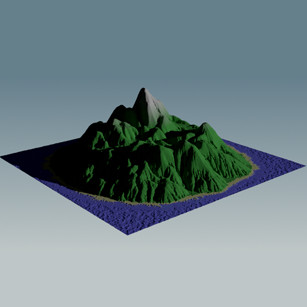

[](https://github.com/jakethorn/MXSL/blob/main/LICENSE)
[](https://github.com/jakethorn/MXSL/releases/latest)
[](https://github.com/jakethorn/MXSL/actions)

# ShadingLanguageX
__ShadingLanguageX__ is a high level shading language that can be used to create complex MaterialX materials.  
  


# Getting Started

## Installation
__ShadingLanguageX__ source files are compiled to MaterialX (.mtlx) files using its open source compiler. The compiler is written in python and can be cloned or downloaded as a package and called from your own python project. 
```
import mxslc
mxslc.compile_file("grass.mxsl")
```
Alternatively, you can directly download the compiler executable from the most recent release and call it from the command line.
```
./mxslc.exe grass.mxsl
```
Both methods have the same input signature, a mandatory path to a __ShadingLanguageX__ source file and then several optional arguments.

## Language Specification
__ShadingLanguageX__ is a high level shading with a syntax similar to C, but with many aspects directly linked to the MaterialX specification. `vector2`, `vector3`, `vector4`, `color3` and `color4` data types are native to the language. All expressions in __ShadingLanguageX__ compile directly to one or more underlying MaterialX nodes, for example, the `+` operator (e.g., `float x = 1.0 + 1.0;`) intuitively compiles to the `add` node, and the same for all other mathematical operators. `if` expressions compile to either of the `ifgreater`, `ifgreatereq` or `ifequal` nodes. `switch` expressions compile to the `switch` node. The swizzle operator (e.g., `some_vector.xy`) compiles to `extract` and `combine` nodes. Most MaterialX nodes are represented by a standard library of functions that is built into the language, such as `color3 c = image("butterfly1.png");` which would compile to the `image` node. Additionally, declaring a variable (e.g., `vec3 up = vec3(0, 1, 0);`) compiles to a `constant` node (or a `combine` node depending on the inputs to the expression).  
  
For more information about __ShadingLanguageX__ syntax and additional compiler options, see the [language specification](https://github.com/jakethorn/ShadingLanguageX/blob/main/language-spec/LanguageSpecification_v0_1-beta.md).  
  
You can also look through example source files [here](https://github.com/jakethorn/ShadingLanguageX/tree/main/examples) to see uses of __ShadingLanguageX__.


# Examples
Red Brick                    |  Interior Mapping
:---------------------------:|:---------------------------:
   |  
__Shader Art (by Kishimisu)__    |  __Interior Mapping with shadows (by VRBN)__
  |  
__Displacement Mountain__    |    __Procedural Rain__
   |  

# Contributing
Please try out __ShadingLanguageX__ and start a discussion about a feature you'd like to see or an issue if you find a bug, or feel free to contribute directly to the project by opening a pull request!
