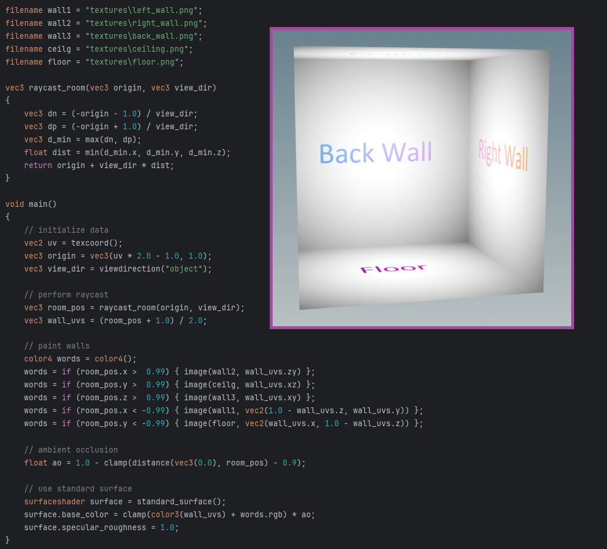
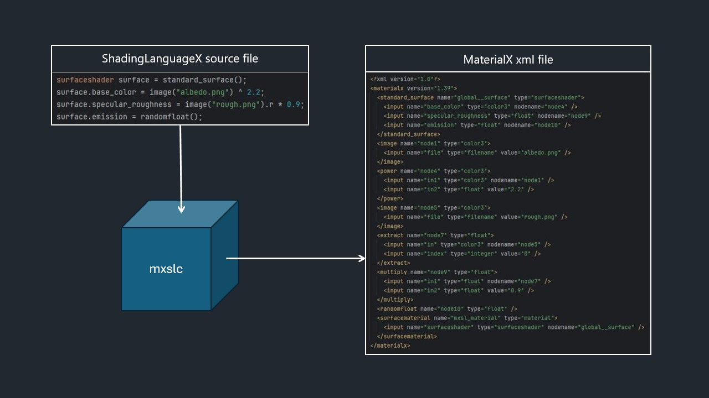
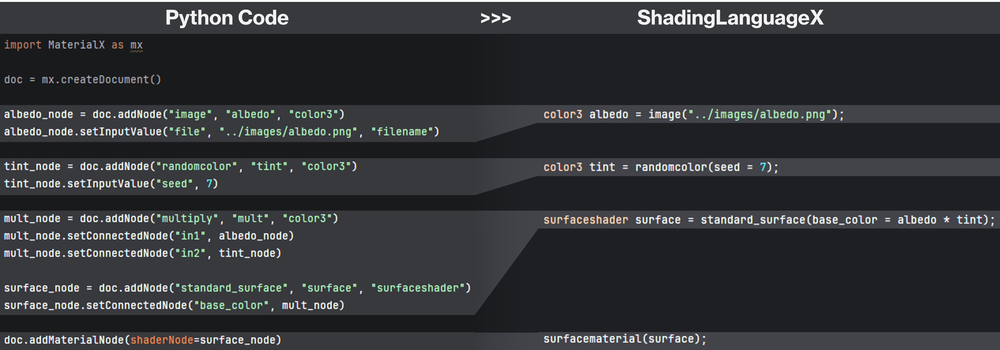
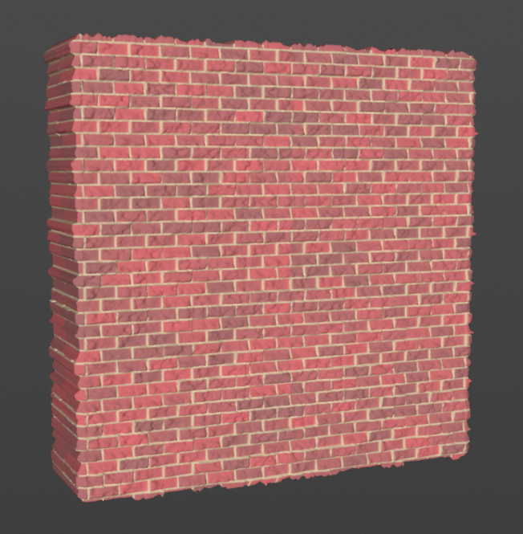
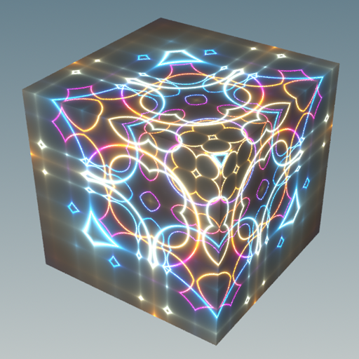
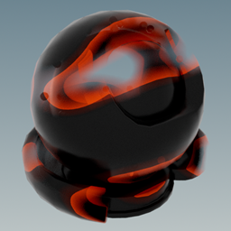

  
<h1 align="center">ShadingLanguageX</h1>

[](https://github.com/jakethorn/ShadingLanguageX/blob/main/LICENSE)


__ShadingLanguageX__ is a high level programming language for [MaterialX](https://materialx.org/) that makes it easier to express complex shading algorithms.  
Click [here](https://youtu.be/n0-5Tx9cS58?si=tRpTGt7ZWPGW0eh0) to see the ASWF talk from SIGGRAPH 2025.

```
// squares.mxsl

global float scale;

float u, v = texcoord() * scale;
float seed = floor(u) + floor(v) * scale;
color3 c = randomcolor(seed);

surfaceshader surf = standard_surface(base_color=c, specular_roughness=1);
material mat = surfacematerial(surf);
```
Compile using python:
```python
import mxslc
mxslc.compile_file_to_file("squares.mxsl", globals={"scale": 10.0})
```
or executable:
```bash
> ./mxslc.exe squares.mxsl -g tiling 10.0
```


# Getting Started

__ShadingLanguageX__ source files are compiled to MaterialX (.mtlx) files using its open source compiler (`mxslc`). The 
compiler is written in C++, but provides Python and JavaScript bindings. The python bindings can be downloaded from PyPI using `pip install mxslcxx`.

```python
import mxslc

code = """
const vec2 uv = position().xy;

mutable float scale = 2;
mutable float height = 0;

for (int i from 0 to 3)
{
    float scale2 = scale * scale;
    height += noise2d(texcoord = uv / scale2) * scale2;
    scale *= 2;
}

surfacematerial(
    standard_surface(
        base_color = color3{0.820, 0.796, 0.761},
        metalness = 0.0,
        specular_roughness = 1.0
    ),
    null,
    displacement(height)
);
"""

mxslc.compile_string_to_file(code, "brownian_mountain.mtlx")
```

See the [User Guide](https://github.com/jakethorn/ShadingLanguageX/blob/main/docs/UserGuide.md) for more information
about how to install and use ShadingLanguageX.

# Language Features
For information about __ShadingLanguageX__ features and syntax, see the [language specification document](https://github.com/jakethorn/ShadingLanguageX/blob/main/docs/LanguageSpecification.md).  
Examples of __ShadingLanguageX__ shaders in addition to the one below can be found in the [basic examples document](https://github.com/jakethorn/ShadingLanguageX/blob/main/docs/BasicExamples.md) 
and the [examples directory](https://github.com/jakethorn/ShadingLanguageX/tree/main/examples).





# How It Works
  

__ShadingLanguageX__ source files are compiled to MaterialX (.mtlx) files using the mxslc compiler. Internally, the source file is tokenized and parsed 
into a tree of statements and expressions which in turn map to one or more MaterialX nodes. These nodes are then written to the MaterialX output file 
as shown in the diagram above.  
For example, the `+` operator (e.g., `float x = 1.0 + 1.0;`) intuitively compiles to the `add` node, and the same for all other mathematical operators. 
`if` expressions compile to either of the `ifgreater`, `ifgreatereq` or `ifequal` nodes depending on the condition. `switch` expressions compile to 
the `switch` node. The swizzle operator (e.g., `some_vector.xy`) compiles to `extract` and `combine` nodes. Most MaterialX nodes are represented by a 
standard library function that is built into the language, such as `color3 c = image("albedo.png");`, which compiles to the `image` node, 
or `vec3 p = position()`, which compiles to the `position` node. Additionally, 
declaring a variable (e.g., `vec3 up = vec3{0.0, 1.0, 0.0};`) compiles to a `constant` node (or a `combine` node depending on the inputs to the expression).  


# Why Use ShadingLanguageX?

Currently, MaterialX shaders can be made either using the official MaterialX API, or using a graph editor software. __ShadingLanguageX__ offers a third way to create MaterialX shaders that provides several benefits over existing methods when creating complex shaders.
* __Express Complex Logic__ - The MaterialX API can be quite verbose to use when using it to create shaders because it needs to provide control over every aspect of MaterialX. Developers can write their own wrappers around the API, but this takes time and knowledge about MaterialX. __ShadingLanguageX__ provides less functionality than the MaterialX API, but in return provides a more streamlined language that was developed specifically for building MaterialX shaders. This allows developers to express algorithms with far fewer lines of code. There is also no setup code to write, just the shaders and a call to the compiler.
  
  
* __Manage Complexity and Reuse Code__ - Similarly, graph editors can become difficult to use when developing shaders with a large number of nodes and often have limited function reusability features between shaders. __ShadingLanguageX__ provides for loops, user-defined functions and `#include` directives that make it easier to create shaders with thousands of nodes and reuse code between projects.
* __Shader Variations__ - __ShadingLanguageX__ also provides mechanisms to easily create shader variations either by passing in values at compile time or defining macros to change the shaders behaviour each time its run.


# Showcases
|               Interior Mapping + Procedural Rain               |               Procedural Waves                |               Brownian Mountain                |
|:-------------------------------------------:|:---------------------------------------------:|:---------------------------------------------:|
|           |  |  |
|            __Procedural Brick__             |        __Shader Art (by Kishimisu)__        |        __Disintegration__        |
|          |         |         |

# Contributing
Please try out __ShadingLanguageX__ and start a discussion about a feature you'd like to see or an issue if you find a bug, or feel free to contribute directly to the project by opening a pull request!
