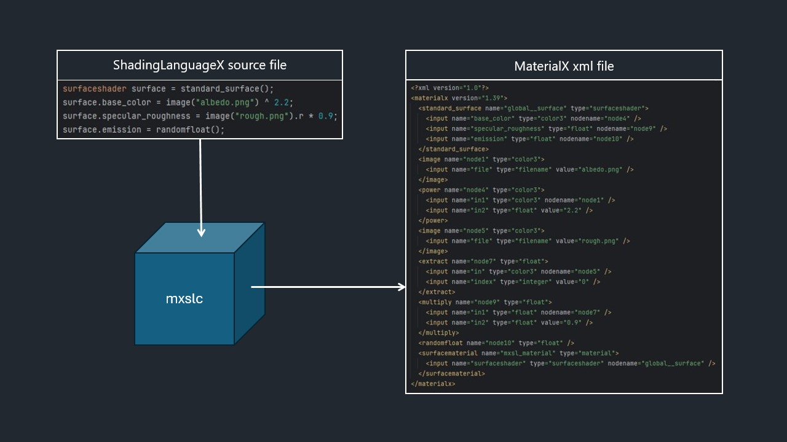
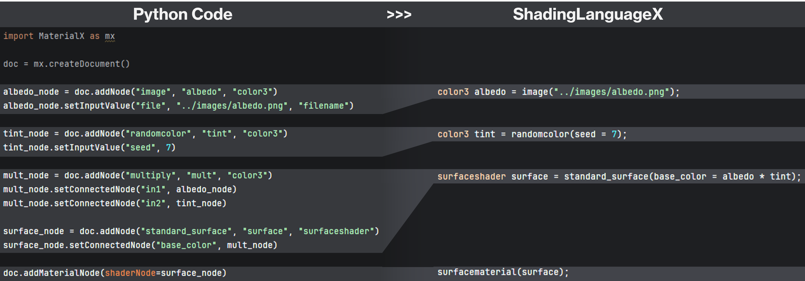
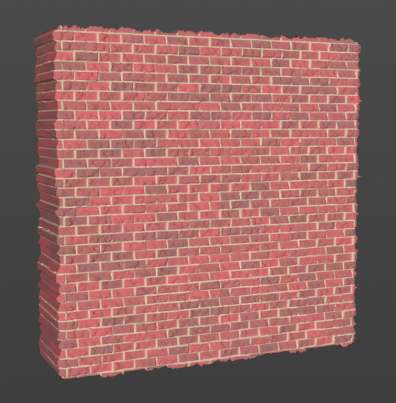
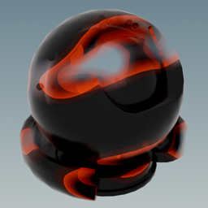

  
<h1 align="center">ShadingLanguageX</h1>

[](https://github.com/jakethorn/ShadingLanguageX/blob/main/LICENSE)
[](https://github.com/jakethorn/ShadingLanguageX/releases)
[](https://github.com/jakethorn/ShadingLanguageX/stargazers)
[](https://pypi.org/project/mxslcxx/)
[](https://pypi.org/project/mxslcxx/)
[](https://github.com/jakethorn/ShadingLanguageX/actions/workflows/run-tests.yml)
[](https://github.com/jakethorn/ShadingLanguageX/actions/workflows/build-wheels.yml)
[](https://github.com/jakethorn/ShadingLanguageX/actions/workflows/build-js.yml)
[](https://github.com/jakethorn/ShadingLanguageX/actions/workflows/publish-wheels.yml)
[](https://github.com/jakethorn/ShadingLanguageX/actions/workflows/release-js.yml)

__ShadingLanguageX (SLX)__ is a high level programming language for [MaterialX](https://materialx.org/) that makes it easier to express complex shading algorithms.  

<p align="center">
  
</p>

# Getting Started

## Code Editors

There are several web-based editors that support ShadingLanguageX.

[MaterialX Playground](https://joaovbs96.github.io/MaterialXPlayground/) (by João Vítor Silva) is a comprehensive MaterialX graph editor and viewer, allowing users to view and compare multiple 
MaterialX or USD scenes at once. SLX source files can be loaded and edited alongside their compiled MaterialX
shader graph, and decompilation allows roundtripping between both views. It also provides syntax highlighting, code completion, 
and documentation links for standard library functions for SLX.

[ShadingLanguageX Playground](https://raccoon.website/shadinglanguagex/) (by Mejval5) allows users to write SLX
shaders and save them as projects between sessions. Projects can also be shared publicly via the [gallery](https://raccoon.website/shadinglanguagex/gallery/) 
(think Shadertoy for SLX). The code editor provides syntax highlighting and gives examples to base your own shaders off of.

[SLX to MTLX Converter](https://jakethorn.github.io/ShadingLanguageX/) (by Bernard Kwok) is the official tool for compiling 
SLX source code to MaterialX.

## Installation

If you prefer to run the compiler yourself or need to pass custom compiler options, then you can install it locally.
The compiler is written in C++ but provides both Python and JavaScript bindings. It is available on Windows, Linux and macOS.
The easiest way to install the compiler is to use pip and run it in Python.

```bash
pip install mxslcxx
```
```python
import mxslc

code = """
float scale = 10;

float u, v = texcoord() * scale;
float seed = floor(u) + floor(v) * scale;
color3 c = randomcolor(seed);

surfaceshader surf = standard_surface(base_color=c, specular_roughness=1);
material mat = surfacematerial(surf);
"""

mtlx = mxslc.compile_string_to_string(code)
```

<p align="center">
  
</p>

## Learning Resources

The [Language Specification](https://github.com/jakethorn/ShadingLanguageX/blob/main/docs/LanguageSpecification.md) document contains 
information about the features and syntax of SLX and covers everything from variable definition syntax to preprocessor directives.  

The [Basic Examples](https://github.com/jakethorn/ShadingLanguageX/blob/main/docs/BasicExamples.md) document
and [Examples](https://github.com/jakethorn/ShadingLanguageX/tree/main/examples) directory contain examples in addition to the ones that can be found in this document.

The [User Guide](https://github.com/jakethorn/ShadingLanguageX/blob/main/docs/UserGuide.md) provides even more information about how to install and use the SLX compiler (mxslc).

# How It Works

  

__ShadingLanguageX__ source files are compiled to MaterialX (.mtlx) files using the mxslc compiler. Internally, the source file is tokenized and parsed 
into a tree of statements and expressions which in turn map to one or more MaterialX nodes. These nodes are then written to the MaterialX document 
as shown in the diagram above.  
For example, the `+` operator (e.g., `float x = 1.0 + 1.0;`) intuitively compiles to the `add` node, and the same for all other mathematical operators. 
`if` expressions compile to either of the `ifgreater`, `ifgreatereq` or `ifequal` nodes depending on the condition. `switch` expressions compile to 
the `switch` node. The swizzle operator (e.g., `some_vector.xy`) compiles to `extract` and `combine` nodes. Most MaterialX nodes are represented by a 
standard library function that is built into the language, such as `color3 c = image("albedo.png");`, which compiles to the `image` node, 
or `vec3 p = position()`, which compiles to the `position` node. Additionally, 
declaring a variable (e.g., `vec3 up = vec3{0.0, 1.0, 0.0};`) compiles to a `constant` node (or a `combine` node depending on the inputs to the expression).  


# Why Use ShadingLanguageX?

Currently, MaterialX shaders can be made either using the official MaterialX API, or using a graph editor. __ShadingLanguageX__ offers a third way to create MaterialX shaders that provides several benefits over existing methods when creating complex shaders.
* __Express Complex Logic__ - The MaterialX API can be quite verbose when using it to create shaders because it needs to provide control over every aspect of MaterialX. Developers can write their own wrappers around the API, but this takes time and knowledge about MaterialX. __ShadingLanguageX__ provides less functionality than the MaterialX API, but in return provides a far more streamlined language that was developed specifically for building MaterialX shaders. This allows developers to express algorithms with far fewer lines of code. There is also no setup code to write, just the shaders and a call to the compiler.
  
  
* __Manage Complexity and Reuse Code__ - Similarly, graph editors can become difficult to use when developing shaders with a large number of nodes and often have limited function reusability features between shaders. __ShadingLanguageX__ provides for loops, user-defined functions and `#include` directives that make it easier to create shaders with thousands of nodes and reuse code between projects.
* __Shader Variations__ - __ShadingLanguageX__ also provides mechanisms to easily create shader variations either by passing in values at compile time or defining macros to change the shaders behaviour each time its run.

# Showcases

|               Interior Mapping + Procedural Rain               |               Procedural Waves                |               Brownian Mountain                |
|:-------------------------------------------:|:---------------------------------------------:|:---------------------------------------------:|
|           |  |  |
|            __Procedural Brick__             |        __Shader Art (by Kishimisu)__        |        __Disintegration__        |
|          |         |         |

# Talks

[ASWF Open Source Days (2025)](https://youtu.be/n0-5Tx9cS58?si=tRpTGt7ZWPGW0eh0)  
[ICE.ART 2026.II (2026)](https://youtu.be/bszZDcxKgGk?si=lgmiK5oldnK6OBL9)


# Contributing
Please try out __ShadingLanguageX__ and start a discussion about a feature you'd like to see or an issue if you find a bug, or feel free to contribute directly to the project by opening a pull request!
