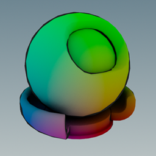
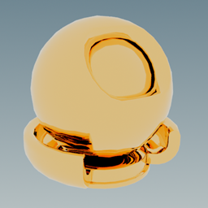

<h1 align="center">ShadingLanguageX Language Specification</h1>

<p align="center">
  
</p>

# Table of Contents

1. [Introduction](#introduction)
2. [Shader Anatomy](#shader-anatomy) 
3. [Data Types](#data-types)
4. [Expressions](#expressions)
5. [Statements](#statements)
6. [Identifiers](#identifiers)
7. [Reserved Keywords](#reserved-keywords)
8. [Whitespace](#whitespace)
9. [Comments](#comments)
10. [Operators](#operators)
11. [Variable Declarations](#variable-declarations)
12. [Variable Assignments](#variable-assignments)
13. [Constructors](#constructors)
14. [If Expressions](#if-expressions)
15. [Switch Expressions](#switch-expressions)
16. [For Loops](#for-loops)
17. [User Functions](#user-functions)
18. [Attributes](#attributes)
19. [Node Constructors](#node-constructors)
20. [Null Expressions](#null-expression)
21. [Standard Library](#standard-library)
22. [Scope](#scope) 
23. [Preprocessor Directives](#preprocessor-directives)
24. [mxslc](#mxslc)

# Introduction

ShadingLanguageX is a high level programming language that allows developers to write shaders that can be compiled into MaterialX (.mtlx) files.
The primary use case is to provide a method of creating MaterialX shaders that overcomes some of the weaknesses of using a node editor or the MaterialX C++ or Python API.
Node editors are very useful for getting quick feedback during shader development or when creating simple shader networks, but are difficult to use the larger the network becomes. 
At the same time, the MaterialX API can be quite verbose, reducing code readability and making it difficult to quickly iterate when writing a shader, without writing your own custom wrapper around the API first.
ShadingLanguageX is a simple, yet powerful language for writing complex MaterialX shaders that aims to overcome these drawbacks.

A core aim of ShadingLanguageX is to maximize portability. At the time of writing, many renderers and frameworks only support 
a subset of the MaterialX specification. To ensure that ShaderLanguageX is compatible with as many platforms as possible, 
it compiles only to standard node elements. As of _version 0.5-beta_, functions and for loops compile to NodeDef/NodeGraphs
for better cohesion with the main MaterialX specification. As support for MaterialX becomes more
mature and as we continue to work on ShadingLanguageX more features will become utilised.

At the end of the day, ShadingLanguageX is based on the MaterialX specification and we've striven for equavilency as much
as possible. As such, if anything is omitted from this document, you can assume that the behaviour is the same as what is
described in the official MaterialX [specification](https://github.com/AcademySoftwareFoundation/MaterialX/blob/main/documents/Specification/MaterialX.Specification.md). For example, we don't specify in this document what is the return 
type of a `vector3` multiplied by a `float`, as it is already described in the MaterialX Standard Node [document](https://github.com/AcademySoftwareFoundation/MaterialX/blob/main/documents/Specification/MaterialX.StandardNodes.md). 
This is to keep this document as concise as possible as well as to reduce the chance of needing to update it in the future 
due to changes to the official MaterialX documentation.

# Shader Anatomy

ShadingLanguageX shaders consist simply of a list of statements that are sequentially compiled into MaterialX nodes. For example:
```
vec3 v = viewdirection();
vec3 n = normal();
float theta = -dotproduct(v, n);
float outline = smoothstep(theta, 0.2, 0.25);
color3 c = color3(position() * outline);
surfaceshader surface = standard_surface();
surface.base_color = c;
surface.specular_roughness = 1.0;
material toon_material = surfacematerial(surface);
```
`> ./mxslc.exe my_shader.mxsl`  
  
compiles to:
```
<?xml version="1.0"?>
<materialx version="1.39">
  <viewdirection name="v" type="vector3" />
  <normal name="n" type="vector3" />
  <dotproduct name="node1" type="float">
    <input name="in1" type="vector3" nodename="v" />
    <input name="in2" type="vector3" nodename="n" />
  </dotproduct>
  <subtract name="theta" type="float">
    <input name="in1" type="float" value="0" />
    <input name="in2" type="float" nodename="node1" />
  </subtract>
  <smoothstep name="outline" type="float">
    <input name="in" type="float" nodename="theta" />
    <input name="low" type="float" value="0.2" />
    <input name="high" type="float" value="0.25" />
  </smoothstep>
  <position name="node4" type="vector3" />
  <multiply name="node9" type="vector3">
    <input name="in1" type="vector3" nodename="node4" />
    <input name="in2" type="float" nodename="outline" />
  </multiply>
  <convert name="c" type="color3">
    <input name="in" type="vector3" nodename="node9" />
  </convert>
  <standard_surface name="surface" type="surfaceshader">
    <input name="base_color" type="color3" nodename="c" />
    <input name="specular_roughness" type="float" value="1" />
  </standard_surface>
  <surfacematerial name="toon_material" type="material">
    <input name="surfaceshader" type="surfaceshader" nodename="surface" />
  </surfacematerial>
</materialx>
```


However, ShadingLanguageX shaders can also be executed with a designated entry function like in C. If the shader contains
a function called `main`, this function will be the entry into the shader. Otherwise, an entry function name can be passed
to the compiler as an additional argument (see [mxslc](https://github.com/jakethorn/ShadingLanguageX/blob/main/docs/LanguageSpecification.md#mxslc) section below for more information). If the entry function accepts any arguments, these can also
be passed to the compiler. For example:
```
material my_function(float r, float g, float b, float roughness, float metalness)
{
    return surfacematerial(
        standard_surface(
            base_color = color3(r, g, b),
            specular_roughness = roughness,
            metalness = metalness
        )
    );
}
```
`> ./mxslc.exe my_shader.mxsl -m my_function -a 1.0 0.72 0.315 0.02 1.0`  
  


When executing a shader in this manner, all global variables and functions will be defined before the entry function is called.

# Data Types

Supported data types match the ones found in the MaterialX specification, with the exception of arrays.  
  
## Supported Data Types

| Data Type            | Example                       |
|----------------------|-------------------------------|
| `boolean`            | `true` or `false`             |
| `integer`            | `79`                          |
| `float`              | `2.2`                         |
| `vector2`            | `vector2(0.0, 1.0)`           |
| `vector3`            | `vector3(0.0, 1.0, 2.0)`      |
| `vector4`            | `vector4(0.0, 1.0, 2.0, 3.0)` |
| `color3`             | `color3(1.0, 0.0, 0.0)`       |
| `color4`             | `color4(1.0, 0.0, 0.0, 1.0)`  |
| `matrix33`           | `creatematrix(...)`           |
| `matrix44`           | `creatematrix(...)`           |
| `string`             | `"tangent"`                   |
| `filename`           | `"../textures/albedo.png"`    |
| `surfaceshader`      | `standard_surface(...)`       |
| `displacementshader` | `displacement(...)`           |
| `volumeshader`       | `volume(...)`                 |
| `lightshader`        | `light(...)`                  |
| `material`           | `surfacematerial(...)`        |
| `BSDF`               | `chiang_hair_bsdf(...)`       |
| `EDF`                | `uniform_edf(...)`            |
| `VDF`                | `absorption_vdf(...)`         |

## Type Aliases

ShadingLanguageX provides the following type aliases. They are functionally equivalent to their underlying type.
In this document we will typically use the aliased version for the sake of brevity.

`boolean` ➔ `bool`  
`integer` ➔ `int`  
`vector2` ➔ `vec2`  
`vector3` ➔ `vec3`  
`vector4` ➔ `vec4`

## Auto

Variables and functions can also be declared using the `auto` keyword where the type can be inferred from the right-hand 
expression in the case of a variable declaration or the return expression for functions.

### Example

```
auto pi = 3.14;  
auto red = color3(1.0, 0.0, 0.0);
auto uv = texcoord<vec2>();

auto add_one(float x)
{
    return x + 1.0;
}

auto randomvector<vec2, vec3, vec4>()
{
    float r = randomfloat();
    return T(r);
}
```

# Expressions

Expressions are pieces of code that evaluate to a value, such as `1.0 + 1.0`. This document will cover each expression in detail
in its own section. The following table gives a quick overview of all the expressions supported by ShadingLanguageX.

| Expression                  | Example                              |
|-----------------------------|--------------------------------------|
| Binary Operator             | `a + b`                              |
| Unary Operator              | `-a`                                 |
| Ternary Relational Operator | `x < a < y`                          |
| Swizzle Operator            | `a.xy`                               |
| Indexing Operator           | `a[0]`                               |
| Literal                     | `3.14`                               |
| Identifier                  | `a`                                  |
| Grouping Expression         | `(a + b)`                            |
| If Expression               | `if (a < b) { x } else { y }`        |
| Switch Expression           | `switch (a) { x, y, z }`             |
| Function Call               | `my_function(a, b)`                  |
| Constructor Call            | `vec3()`                             |
| Node Constructor            | `{"mix", color3: bg=a, fg=b, mix=c}` |

# Statements

Statements are pieces of code that change the state of the program, either by storing a named variable or function so it
can be accessed later or by controlling the flow of the program. Statements are typically termined with the semicolon `;`. 
This document will cover each statement in detail in its own section. The following table gives a quick overview of all 
the statements supported by ShadingLanguageX.

| Statement             | Example                                      |
|-----------------------|----------------------------------------------|
| Variable Declaration  | `float a = 0.714;`                           |
| Variable Assignment   | `a = 0.667;`                                 |
| Compound Assignment   | `a *= 10.0;`                                 |
| Function Declaration  | `float add_one(float a) { return a + 1.0; }` |
| For Loop              | `for (int i = 0:10) { a = add_one(a); }`     |
| Expression Statement  | `standard_surface(base_color=color3(a));`    |

# Identifiers

Identifiers are the names given to user-defined variables and functions so they can be accessed later in the program.
ShadingLanguageX follows the paradigm implemented in most programming languages: identifiers can contain letters, numbers and the underscore character, with the exception that the first character cannot be a number.
They also cannot be the same as a ShadingLanguageX reserved keyword (see below).

### Example

```
int i = 0;
int _i = i + 1;
vec3 __UP__ = vec3(0.0, 1.0, 0.0);
float n_angle = dotproduct(__UP__, normal());
float pi2 = 3.14 * 2.0;
```

# Reserved Keywords

The following identifiers have a special meaning in ShadingLanguageX and cannot be used for user-defined variables or functions.

`if` `else` `switch` `for` `return` `true` `false` `and` `or` `not` `void` `null` `T`

All data types and alias types are also reserved keywords.

### Notes

ShadingLanguageX is an evolving language. Keywords might be added in each update which might cause shaders to break which 
were previously working correctly. In general, try not to use identifiers that are popular keywords in other
languages (e.g., `const` `struct` `typeof`) or a term that is prominantly used in the MaterialX specification (e.g., `node` `uniform` `varying`). 

# Whitespace

All whitespace is treated equally in ShadingLanguageX. A single space character is the same as 10 new line characters. For example:  
  
`float a = 1.0;`  
  
is equivalent to:
```
float
a
=
1.0
;
```
although we do not recommend the latter for readability reasons.

# Comments

Comments in ShandingLanguageX take the sole form of: `// this is a comment`.

# Operators

| Operation | MaterialX Node(s)   |
|-----------|---------------------|
| `a + b`   | `add`               |
| `a - b`   | `subtract`          |
| `a * b`   | `multiply`          |
| `a / b`   | `divide`            |
| `a % b`   | `modulo`            |
| `a ^ b`   | `power` or `xor`    |
| `a > b`   | `ifgreater`         |
| `a >= b`  | `ifgreatereq`       |
| `a < b`   | `ifgreatereq`       |
| `a <= b`  | `ifgreater`         |
| `a == b`  | `ifequal`           |
| `a != b`  | `ifequal`+`not`     |
| `a & b`   | `and`               |
| `a and b` | `and`               |
| `a \| b`  | `or`                |
| `a or b`  | `or`                |
| `!a`      | `not`               |
| `not a`   | `not`               |
| `-a`      | `subtract`          |
| `+a`      |                     |
| `a[b]`    | `extract`           |
| `a.b`     | `extract`+`combine` |
| `(a)`     |                     |

### Notes

* The `^` operator compiles to a `power` node when used with numeric types and to an `xor` node when used with booleans.
* The MaterialX arithmetic nodes specify that vectors/colors must be the first input if paired with a float, however this 
is not the case in ShadingLanguageX, a vector/color can be either the left or right value, for example, `2.0 * vec3()` 
is equivalent to `vec3() * 2.0`.

## Ternary Relational Operator

ShadingLanguageX supports the Ternary Relational Operator: `a < x < b`, which is equivalent to `a < x and x < b`.
This form can be used with any of the relational operators (i.e., `<` `<=` `>` `>=`).

## Swizzle Operator

Currently, the only expression that uses the period character `a.b` is the Swizzle Operator. The Swizzle Operator allows
users to access vector components using any of `x` `y` `z` `w` or color channels using `r` `g` `b` `a` after the period. 
For example, `vec3 b = a.yyz;` is equivalent to `vec3 b = vec3(a[1], a[1], a[2]);`.
The characters `x` `y` `z` `w` can only be used to access components from a vector, it is a syntax error to use them with
a color type variable. The opposite is then true for `r` `g` `b` `a`. 
Swizzles can be made from any combination of valid characters, with a maximum number of 4 characters. However, a character cannot
be used that goes beyond the length of original vector, for example, `a.xyz` is an invalid swizzle for a variable of type 
`vec2` because it does not have a z component.
Finally, vector swizzles will always return a vector or `float` type variable, the specific type is dependant on the swizzle, for example 
`a.xy` return a `vec2`, while `a.zyzy` returns a `vec4`. Appropriately, color swizzles only return color or `float` type variables.

### Example

`float alpha = image("alpha_mask.png").a;`  
`vec2 left_wall_uv = position().yz;`  
`color3 all_red = randomcolor().rrr;`

## Precendence 

| Order of Precendence (higher operations evaluate first) |
|---------------------------------------------------------|
| `(a)`                                                   |
| `a.b` `a[b]`                                            |
| `-a` `+a` `!a` `not a`                                  |
| `a ^ b`                                                 |
| `a * b` `a / b` `a % b`                                 |
| `a + b` `a - b`                                         |
| `a > b` `a >= b` `a < b` `a <= b`                       |
| `a == b` `a != b`                                       |
| `a & b` `a and b` `a \| b` `a or b`                     |

When two operators with equal precedence are used, the leftmost operator with evaluate first.  
As shown in the table above, precendence can be controlled using the Grouping Operator `(a)`. For example, in the expression
`a + b * c`, the `b * c` will evaluate first, however, in the expression `(a + b) * c`, the `a + b` will evaluate first.

# Variable Declarations

`type name = initial-value;`  
`type` can be any supported data type as listed earlier.  
`name` can be any valid identifier.  
`initial-value` can be any valid expression that evaluates to `type`.   

### Notes

* The `initial-value` is not optional as in most other languages.

### Example

`float a = 1.0;`  
`float b = a;`  
`bool is_positive = b > 0.0;`  
`int uv_channel = 3;`  
`vec2 uv = 1.0 - texcoord(uv_channel);`  
`string space = "world";`  
`surfaceshader surface = standard_surface();`

# Variable Assignments

`name = value;`  
`name` must be the name of a previously declared variable.  
`value` can be any valid expression that evaluates to the type of `name`.

### Example

```
color3 albedo = image("albedo.png");
albedo = 1.0 - albedo;
```

## Compound Assignment

| Assignment  | Expands to     |
|-------------|----------------|
| `a += b;`   | `a = a + b;`   |
| `a -= b;`   | `a = a - b;`   |
| `a *= b;`   | `a = a * b;`   |
| `a /= b;`   | `a = a / b;`   |
| `a %= b;`   | `a = a % b;`   |
| `a ^= b;`   | `a = a ^ b;`   |
| `a &= b;`   | `a = a & b;`   |
| `a \|= b;`  | `a = a \| b;`  |

# Constructors

`type(...)`  
`type` can be `bool` `int` `float` `vec2` `vec3` `vec4` `color3` `color4`.  

The constructor has the same name as the type itself and accepts zero or more arguments. 
The behaviour of the constructor changes depending on the number of arguments provided,
but will always return a variable of the corresponding type.

## Zero Arguments

In the case that no arguments are passed to the constructor a default value will be returned.

| Data Type | Default Value                |
|-----------|------------------------------|
| `bool`    | `false`                      |
| `int`     | `0`                          |
| `float`   | `0.0`                        |
| `vec2`    | `vec2(0.0, 0.0)`             |
| `vec3`    | `vec3(0.0, 0.0, 0.0)`        |
| `vec4`    | `vec4(0.0, 0.0, 0.0, 1.0)`   |
| `color3`  | `color3(0.0, 0.0, 0.0)`      |
| `color4`  | `color4(0.0, 0.0, 0.0, 1.0)` |

## One Argument

With a single argument, the constructor will convert the argument to the type of the constructor.
Currently, this simply compiles to the `convert` node. For information regarding supported conversions, 
see the MaterialX Standard Node document.

### Notes

ShadingLanguageX does not support implicit conversions. Explicit conversions can be achieved using constructors with a single argument.

### Example

`float shadow = float(x > y);`  
`color3 white = color3(1.0);`  
`color3 v_debug = color3(viewdirection());`

## Two Or More Arguments

Two or more arguments has the following behaviour. It will take components from incoming arguments until all of its own
components have been filled and then discard the rest. If not enough components were provided, then the remaining will be `0.0`.

### Example

`vec2 a = vec2(1.0, 2.0);`  
`vec3 b = vec3(a, 3.0); // will be vec3(1.0, 2.0, 3.0)`  
`vec4 c = vec4(4.0, a); // will be vec4(4.0, 1.0, 2.0, 0.0)`

# If Expressions

Unlike most languages, ShaderLanguageX does not support if statements, but instead uses if expressions. The reason for this is because conditional nodes (`ifequal`, `ifgreater` and `ifgreatereq`) in MaterialX act more like
ternary operators (`cond ? then : else`) than true if statements that control the logic of the program. This makes if expressions better suited for compiling to MaterialX nodes than if statements.

`if (condition) { value_if_true } else { value_if_false }`  
`condition` can be any expression that evaluates to a bool type.  
The if expression will evaluate to `value_if_true` if the condition is true, otherwise `value_if_false`. 

The syntax `if (condition) { value_if_true }` can be used during an assignment statement. In this case, if the condition
evaluates to false, the variable will retain its original value.

As mentioned earlier, ShadingLanguageX does not support implicit type conversions. As such, both sides of the if expression
are expected to evaluate to the same type. 

### Example

`float a = if (x > y) { 0.05 } else { 0.07 };`  
`a = if (z > x) { 0.09 };` equivalent to `a = if (z > x) { 0.09 } else { a };`  

```
vec3 upaxis = if (target_platform == UNREAL) 
{ 
    vec3(0.0, 0.0, 1.0) 
} 
else 
{ 
    vec3(0.0, 1.0, 0.0) 
};
```

# Switch Expressions

ShaderLanguageX also does not support switch statements, but instead uses switch expressions, for the same reasons as if 
expressions above. They are similar to switch expressions found in the C# programming language.

`switch (which) { in1, in2, in3 }`  
`which` can be any expression that evaluates to either an `int` or `float` type.  
The switch expression will evaluate to either `in1`, `in2`, `in3`, or a default value depending on the value of `which`.
See the `switch` node in the MaterialX Standard Node document for more information.

### Example

```
color3 albedo = switch (wall_id)
{
    image("left_wall.png", texcoord=uv),
    image("right_wall.png", texcoord=uv),
    image("back_wall.png", texcoord=uv),
    image("ceiling.png", texcoord=uv),
    image("floor.png", texcoord=uv)
}
```

# For Loops

Unlike if and switch expressions, loops are compiled as statements in ShadingLanguageX, with the caveat that the number of
loop iterations must be known at compile time. 

```
for (type name = start-value:end-value)
{
    statement*
}
```
`type` can either be `int` or `float`.  
`name` can be any valid identifier.  
`start-value` is the value that the iteration value will start from.  
`end-value` is the value that the iteration value will stop at. It is included in the loop.  
For example, `0:3` will iterate through the values `0` `1` `2` `3`.

For loops can also be declared with an incremement value. Instead of increasing the iteration value by 
`1` each loop, it will be increased by the value of the specified increment instead. The syntax in this case looks like
this: `start-value:increment-value:end-value`. For example, `0:2:6` would result in the following sequence: `0` `2` `4` `6`.

### Example

```
// render 10 randomly sized white circles
color3 c = color3(0.0);
for (int i = 0:9)
{
    vec2 center = vec2(randomfloat(in=0, seed=i), randomfloat(in=1, seed=i));
    c = if (distance(center, texcoord()) < randomfloat(in=2, max=0.1, seed=i)) { color3(1.0) };
}
standard_surface(base_color=c);
```

# User Functions

Users can declare there own functions in ShadingLanguageX using the following syntax:
```
type name(param1_type param1_name, param2_type param2_name...)
{
    statement*
    return value;
}
```
`type` can be any supported data type. It can also be `void` to indicate that function does not return a value.
In this case, the return statement should also be omitted.  
`name` can be any valid identifier.  
`paramN_type` can be any supported data type and `paramN_name` can be any valid identifier. Functions can declare any number of parameters.  
There is no concept of pointers or out parameters in ShadingLanguageX. Arguments are purely used to pass data into the function.
Functions can also read and update variables from enclosing scopes.

## Calling Functions

`name(arg1, arg2...)`  
`name` is the name of function to be invoked.  
`argN` is N number of expressions whose data types exactly match those in the function signature.

### Example

```
float mad(float m, float a, float b)
{
    return m * a + b;
}

float f = mad(1.0, 2.0, 3.0);
```
```
material main(color3 c, float intensity, vec3 n)
{
    return surfacematerial(
       standard_surface(
            base_color = c * intensity,
            normal = n
        )
    );
}

vec3 n = image("normals.png");
material m = main(color3(3.0, 7.0, 5.0), 0.8, n);
```
```
float i = 0.0;
void incr_i()
{
    i += 1.0;
}
incr_i(); // i == 1.0
incr_i(); // i == 2.0
```

## Overloading Functions

Functions in ShadingLanguageX can be overloaded. This means that mutliple functions can have the same name, as long as their function signature is unique. When a function is called, the compiler will determine which of the functions to invoke based on the data types of the arguments passed to the function. For example:
```
float do_something(float f)
{
    return f * 2.0;
}

color3 do_something(color3 c)
{
    return c * 2.0;
}

color3 c = randomcolor();
c = do_something(c);
```
In this case, the call to `do_something()` will invoke the second function because it's being passed an argument of type `color3`.

It's important to note that in ShadingLanguageX, unlike other C-based languages, the return type of a function is included in its signature. For example:
```
vec2 texcoord()
{
    return position().xy;
}

vec3 texcoord()
{
    return position();
}

vec2 uv = texcoord();
```
In this case, the call to `texcoord()` will invoke the first function because it's return value is being assigned to a variable of type `vec2`.

## Default Parameter Values

Function parameters can be declared with a default value. In this case, the user is not required to provide a value for that parameter when calling the function.
```
float azimuth(string space="world", vec3 origin=vec3(1.0, 0.0, 0.0))
{
    return dotproduct(normal(space), origin);
}

float theta = azimuth();
```

## Named Arguments

Function arguments can be named to target specific parameters.
```
float theta = azimuth(origin=vec3(0.0, 0.0, 1.0);
color3 albedo = image("albedo.png", texcoord=geompropvalue("uv4"));
```

## Templated Functions

It's common for functions to use the same logic on different data types.
```
float one_minus(float v)
{
    return 1.0 - v;
}

vec2 one_minus(vec2 v)
{
    return 1.0 - v;
}
```

This type of code is time consuming to both write and read. As such, ShadingLanguageX offers templated functions to streamline these types of functions.
```
T one_minus<float, vec2>(T v)
{
    return 1.0 - v;
}
```

This code is equivalent to the one above, but can also easily be extended to handle other data types as well.
```
T one_minus<float, vec2, vec3, vec4, color3, color4>(T v)
{
    return 1.0 - v;
}
```

In this case, the reserved keyword data type `T` is a placeholder for the data types specified in the template. `T` can be used anywhere in the function signature and inside the body of the function wherever a standard
data type could be used. For example:
```
T image_mult<vec3, color3>(filename img_path, T mult = T(1.0))
{
    T img = image<T>(img_path);
    return img * mult;
}
```

When calling a templated function, the template type can be inferred from the usage of the function, exactly as it works in function overloading. Additionally, the user can also explicitly specify the data type of the function template to use. For example:
```
T one_minus<float, vec2, vec3, vec4, color3, color4>(T v)
{
    return 1.0 - v;
}

vec2 uv = texcoord();
vec2 inv_uv = one_minus<vec2>(uv);
```

### Notes

* Functions can be declared inside other functions.
* Functions must be declared prior to being called.  
* Recursion is not possible in ShadingLanguageX.

# Attributes

Attributes can be defined above statements and are added to the element that the statement compiles into. For example,
attributes defined above a function declaration will be added to the compiled NodeDef.
```
@nodegroup "math"
@doc "adds one to in"
float add_one(float in)
{
    return in + 1.0;
}
```
```xml
<nodedef name="ND_add_one" node="add_one" nodegroup="math" doc="adds one to in">
  <output name="out" type="float" default="0.0" />
  <input name="in" type="float" value="0" />
</nodedef>
<nodegraph name="NG_add_one" nodedef="ND_add_one">
  <add name="node3" type="float">
    <input name="in1" type="float" interfacename="in" />
    <input name="in2" type="float" value="1" />
  </add>
  <output name="out" type="float" nodename="node3" />
</nodegraph>
```
Attributes can also be added to the input/output elements of a NodeDef by specifying the name of the port before the attribute
name. Outputs are called `out` by default in MaterialX.
```
@nodegroup "math"
@doc "adds one to in"
@in.doc "the value to be incremented"
@out.doc "the incremented value"
float add_one(float in)
{
    return in + 1.0;
}
```
```xml
<nodedef name="ND_add_one" node="add_one" nodegroup="math" doc="adds one to in">
  <output name="out" type="float" default="0.0" doc="the incremented value" />
  <input name="in" type="float" value="0" doc="the value to be incremented" />
</nodedef>
<nodegraph name="NG_add_one" nodedef="ND_add_one">
  <add name="node3" type="float">
    <input name="in1" type="float" interfacename="in" />
    <input name="in2" type="float" value="1" />
  </add>
  <output name="out" type="float" nodename="node3" />
</nodegraph>
```
Finally, attributes can also be defined above variable declarations, variable assignments and expression statements. These
attributes will be added to the node that these statements compile into.
```
@doc "an image of a butterfly"
@file.colorspace "srgb_texture"
color3 c = image("butterfly1.png");
```
```xml
<image name="c" type="color3" doc="an image of a butterfly">
  <input name="file" type="filename" colorspace="srgb_texture" value="butterfly1.png" />
</image>
```

# Node Constructors

Node constructors are a unique expression to ShadingLanguageX, but provide crucial functionality.

`{string, type: input1=value1, input2=value2...}`  
`string` can be any valid string value.    
`type` can be any supported data type.  
`inputN` can be any valid identifier.
`valueN` can be any valid expression.

Node constructors compile to the node element specified by `string` and the type specified by `type`. Node inputs are compiled from
the list of inputs that come after the colon `:`. 

Node constructors give developers the ability to define any node that they want, regardless of whether it is implemented
in ShadingLanguageX or not. For example, the `normalmap` node from the MaterialX Standard Node specification changed signature
in v1.39. However, many renderers are still using the v1.38 signature. Node constructors can be used to create node elements
with an old input signature to ensure compatability with as many renderers as possible, or to declare nodes that are not defined
in the MaterialX specification, such as renderer specific nodes.

### Example

#### Normalmap compatability
```
vec normals = image("normals.png");

// v1.38 normalmap
vec3 nm = {"normalmap", vec3: in=normals, space="tangent", scale=0.1};
```
compiles to:
```
<normalmap name="nm" type="vector3">
  <input name="in" type="vector3" nodename="normals" />
  <input name="space" type="string" value="tangent" />
  <input name="scale" type="float" value="0.1" />
</normalmap>
...
```

#### Renderer-specific nodes
```
// Houdini bias node
float bias = {"hmtlxbias", float: in=0.0, bias=0.5};
```

### Notes

Unlike the rest of ShadingLanguageX, node constructors do not perform any type checking. In fact, the data type of the inputs
is determined by the values that are passed to them.

# Null Expression

MaterialX defines default values for all node inputs in the standard library. To use these defaults instead of having to provide your own, you can use the `null` keyword.
```
string layer = if (use_custom_layer) { geompropvalue("custom_layer") } else { null };
color3 c = image("image.png", layer=layer);
```

Null expressions are also useful as default parameter values where it makes sense to use the default MaterialX behaviour.
```
float randomfloat<float, int>(T in=null, float min=null, float max=null, int seed=null)
{
    return {"randomfloat", float: in=in, min=min, max=max, seed=seed);
}
```

# Standard Library 

ShadingLanguageX provides access to the nodes specified in the [MaterialX Data Library](https://github.com/AcademySoftwareFoundation/MaterialX/tree/main/libraries) as a standard library of functions.
More information about these nodes can be found the in the MaterialX StandardNodes, PBRSpec and NPRSpec [documents](https://github.com/AcademySoftwareFoundation/MaterialX/tree/main/documents/Specification).
They are included automatically by the compiler and don't need to be manually included with the `#include` directive.
Functions have the same signature (name, input types and output type) as their respective nodes in the MaterialX specification. Most of them are templated where appropriate and use the `null` expression
to fall back to the default MaterialX behaviour when a parameter is not set.

# Scope

ShadingLanguageX follows the same scoping rules as most C-based languages. Scopes are denoted by a pair of curly braces `{` `}` like in function declarations or for loops. 
Variables are only accessible inside their own scope as well as any nested scopes. 
```
float a = 0.0;
void do_something()
{
    float b = 1.0;
    for (int i = 0:9)
    {
        float c = 2.0;
        a += b / c;
    }
}
```
In the previous example, `a` is part of the global scope and is accessible everywhere, `b` is accessible only inside the `do_something` 
function and the for loop, and `c` is accessible only within the for loop.

# Preprocessor Directives

ShadingLanguageX supports many of the C preprocessor directives:
* File inclusion (`#include`)
* Macro definition (`#define` `#undef`) 
* Conditional compilation (`#if` `#ifdef` `#ifndef` `#elif` `#else` `#endif`)

## File Inclusion

The `#include` directive works as it does in C, but also allows inclusion of directories as well as specific files. All files
with the extension `.mxsl` inside the directory will be included. The search is not recursive, i.e., it does not include `.mxsl`
files from sub-directories and files are not included in any particular order. If the order of included files is important, 
then you should include each file individually in the necessary order.

When including a file, paths may be absolute or relative. If the path is relative, ShadingLanguageX will look for the file in
the following directories in order:
1. Any additional directories passed to the compiler (see Command Line Options below)
2. The parent directory of the `.mxsl` file currently being compiled.
3. The parent directory of the mxslc executable.

### Example

_color_enums.mxsl_:
```
#define RED color3(1.0, 0.0, 0.0)
#define GREEN color3(0.0, 1.0, 0.0)
#define BLUE color3(0.0, 0.0, 1.0)
```

_file_incl_example.mxsl_:
```
#include "color_enums.mxsl"
vec2 uv = texcoord();
color3 c = mix(mix(RED, GREEN, uv.x), BLUE, uv.y);
standard_surface(base_color=c);
```

## Macro Definition

Macros are more limited in ShadingLanguageX than in C. Only flag- and object-like macros are supported, e.g., 
`#define USE_FFT` and `#define PI 3.14159`. Function-like macros as well as macro stringification and token pasting are not supported.

There is currently one macro pre-defined during shader compilation:
* `__MAIN__` is defined during compilation of the file originally given to the compiler.
  
`> ./mxslc.exe macro_def_example.mxsl`
```
// macro_def_example.mxsl
#ifdef __MAIN__ // will be defined in this context
#include "macro_def_incl.mxsl"
#endif
```
```
// macro_def_incl.mxsl
#ifdef __MAIN__ // will not be defined in this context
...
#endif
```

## Conditional Compilation

Conditional compilations directives operate as they do in C with no notable changes.

# mxslc

mxslc is the open-source compiler for ShadingLanguageX. It can downloaded from the github repository [releases](https://github.com/jakethorn/ShadingLanguageX/releases) section.
It can be run either using the compiled executable or with the Python API.  

## Executable

The executable is a compiled version of the Python API with some added argument parsing functionality.

### Command Line Options

```
positional arguments:
  mxsl_path                        Input path to mxsl file or containing folder

options:
  -h, --help                       show this help message and exit
  -o, --output-path OUTPUT_PATH    Output path of generated mtlx file or containing folder
  -m, --main-func MAIN_FUNC        Name of main entry function into the program
  -a, --main-args MAIN_ARGS        Arguments to be passed to the main function
  -i, --include-dirs INCLUDE_DIRS  Additional directories to search when including files
  -d, --define MACROS              Additional macro definitions
```

### Example

```
material color_shader(float r, float g, float b)
{
    return surfacematerial(
        standard_surface(base_color=color3(r, g, b))
    );
}
```
`> ./mxslc.exe example.mxsl -o cyan.mtlx -m color_shader -a 0.0 1.0, 1.0`  


  
```
material main()
{
    color3 c = image("albedo.png");
#ifdef SRGB
    c ^= GAMMA;
#endif
    return surfacematerial(
        standard_surface(base_color=c)
    );
}
```
`> ./mxslc.exe example.mxsl -d SRGB -d GAMMA 2.2`

## Python API

See [here](https://github.com/jakethorn/ShadingLanguageX/blob/main/docs/PythonAPI.md) for the mxslc Python API documentation.
