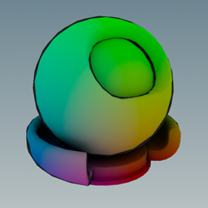
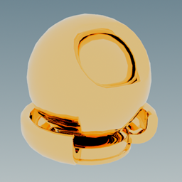

<h1 align="center">ShadingLanguageX Language Specification</h1>

<p align="center">
  
</p>

# Table of Contents

1. [Introduction](#introduction)
2. [Shader Anatomy](#shader-anatomy)
3. [Data Types](#data-types)
4. [Expressions](#expressions)
5. [Statements](#statements)
6. [Literals](#literals)
7. [Identifiers](#identifiers)
8. [Reserved Keywords](#reserved-keywords)
9. [Modifiers](#modifiers)
10. [Whitespace](#whitespace)
11. [Comments](#comments)
12. [Operators](#operators)
13. [Variable Definition](#variable-definition)
14. [Variable Assignment](#variable-assignment)
15. [Named Constructor](#named-constructor)
16. [If Expression](#if-expression)
17. [If Statement](#if-statement)
18. [Switch Expression](#switch-expression)
19. [Compile-Time Evaluation](#compile-time-evaluation)
20. [For Loop](#for-loop)
21. [Functions](#functions)
22. [User-Defined Types](#user-defined-types-1)
23. [Unnamed Constructor](#unnamed-constructor)
24. [Operator Overloading](#operator-overloading)
25. [Print Statement](#print-statement)
26. [Attributes](#attributes)
27. [Null Expression](#null-expression)
28. [Standard Library](#standard-library)
29. [Scope](#scope)
30. [Preprocessor Directives](#preprocessor-directives)

# Introduction

ShadingLanguageX is a high-level programming language that can be compiled into MaterialX (.mtlx) files.
The aim of the project is to provide a method of creating MaterialX shaders that overcomes some of the weaknesses of using a node editor,
which can be difficult when creating large or complex networks, or the MaterialX C++ or Python APIs, which are very verbose, reducing code readability and making it difficult to quickly iterate when writing a shader.
ShadingLanguageX is a simple, yet powerful language for writing complex MaterialX shaders that aims to overcome these drawbacks.

ShadingLanguageX is purely based on the MaterialX [specification](https://github.com/AcademySoftwareFoundation/MaterialX/blob/main/documents/Specification/MaterialX.Specification.md), and we've striven for equivalency as much
as possible. All nodes from the MaterialX Standard Library are supported, represented as a built-in library of functions, and are called 
by the same names as their MaterialX counterparts. More advanced features such as creating NodeDefs and NodeGraphs is also supported.

Beyond the standard library, ShadingLanguageX also offers other features such as for loops, ranges, classes, 
operator overloading, templated functions, preprocessor directives, graph optimisations and more.

If anything is omitted from this document, you can assume that the behaviour is the same as what is
described in the official MaterialX specification. For example, we don't specify in this document what is the return
type of a `vector3` multiplied by a `float`, as it is already described in the MaterialX Standard Node [document](https://github.com/AcademySoftwareFoundation/MaterialX/blob/main/documents/Specification/MaterialX.StandardNodes.md).
This is to keep this document as concise as possible as well as to reduce the chance of needing to update it in the future
due to changes to the official MaterialX documentation.

# Shader Anatomy

ShadingLanguageX shaders consist simply of a list of statements that are sequentially compiled into MaterialX nodes. For example:
```
vec3 v = viewdirection();
vec3 n = normal();
float theta = -dotproduct(v, n);
float outline = smoothstep(theta, 0.2, 0.25);
color3 c = color3{position() * outline};
surfaceshader surface = standard_surface();
surface.base_color = c;
surface.specular_roughness = 1.0;
material toon_material = surfacematerial(surface);
```
`> ./mxslc my_shader.mxsl`

compiles to:
```xml
<?xml version="1.0"?>
<materialx version="1.39">
  <viewdirection name="v" type="vector3" />
  <normal name="n" type="vector3" />
  <dotproduct name="var__0" type="float">
    <input name="in1" type="vector3" nodename="v" />
    <input name="in2" type="vector3" nodename="n" />
  </dotproduct>
  <invert name="theta" type="float">
    <input name="in" type="float" nodename="var__0" />
  </invert>
  <smoothstep name="outline" type="float">
    <input name="in" type="float" nodename="theta" />
    <input name="low" type="float" value="0.2" />
    <input name="high" type="float" value="0.25" />
  </smoothstep>
  <position name="var__1" type="vector3" />
  <multiply name="var__2" type="vector3">
    <input name="in1" type="vector3" nodename="var__1" />
    <input name="in2" type="float" nodename="outline" />
  </multiply>
  <convert name="c" type="color3">
    <input name="in" type="vector3" nodename="var__2" />
  </convert>
  <standard_surface name="surface" type="surfaceshader">
    <input name="base_color" type="color3" nodename="c" />
    <input name="specular_roughness" type="float" value="1" />
  </standard_surface>
  <surfacematerial name="toon_material" type="material">
    <input name="surfaceshader" type="surfaceshader" nodename="surface" />
  </surfacematerial>
</materialx>
```


ShadingLanguageX shaders can also be compiled with a designated entry function. The function name needs
to be passed to the compiler, either using the `-f/--func` option in the command line, or using the `CompileOptions`
struct in C++/Python (see the [User Guide](https://github.com/jakethorn/ShadingLanguageX/blob/main/docs/mxslc%2B%2B/UserGuide.md) for more details). 
For example:
```
inline void main()
{
    surfacematerial(
        standard_surface(
            base_color = color3(1.0, 0.72, 0.315),
            specular_roughness = 0.02,
            metalness = 1.0
        )
    );
}
```
`> ./mxslc my_shader.mxsl -f main`


If the entry function accepts any arguments, these can also be passed to the compiler using the `-a/--args` option or the `CompileOptions` struct. For example:
```
inline void my_function(color3 c, float r, float m)
{
    surfacematerial(
        standard_surface(
            base_color = c,
            specular_roughness = r,
            metalness = m
        )
    );
}
```
```python
import MaterialX as mx
import mxslc
from pathlib import Path

src_path = Path("my_shader.mxsl")
opts = mxslc.CompileOptions(func_name="my_function", func_args=[mx.Color3(1.0, 0.72, 0.315), 0.02, 1.0])
mxslc.compile_file_to_file(src_path, opts)
```



# Data Types

Supported data types match the ones found in the MaterialX specification, with the exception of arrays.

## Primitive Data Types

| Data Type            | Example                       |
|----------------------|-------------------------------|
| `boolean`            | `true` or `false`             |
| `integer`            | `79`                          |
| `float`              | `2.2`                         |
| `vector2`            | `vector2{0.0, 1.0}`           |
| `vector3`            | `vector3{0.0, 1.0, 2.0}`      |
| `vector4`            | `vector4{0.0, 1.0, 2.0, 3.0}` |
| `color3`             | `color3{1.0, 0.0, 0.0}`       |
| `color4`             | `color4{1.0, 0.0, 0.0, 1.0}`  |
| `matrix33`           | `creatematrix(...)`           |
| `matrix44`           | `creatematrix(...)`           |
| `string`             | `"tangent"`                   |
| `filename`           | `"../textures/albedo.png"`    |
| `surfaceshader`      | `standard_surface(...)`       |
| `displacementshader` | `displacement(...)`           |
| `volumeshader`       | `volume(...)`                 |
| `lightshader`        | `light(...)`                  |
| `material`           | `surfacematerial(...)`        |
| `BSDF`               | `chiang_hair_bsdf(...)`       |
| `EDF`                | `uniform_edf(...)`            |
| `VDF`                | `absorption_vdf(...)`         |

## Type Aliases

ShadingLanguageX provides the following type aliases. They are functionally equivalent to their underlying type.
In this document we will typically use the aliased version for the sake of brevity.

`boolean` ➔ `bool`  
`integer` ➔ `int`  
`vector2` ➔ `vec2`  
`vector3` ➔ `vec3`  
`vector4` ➔ `vec4`  
`matrix33` ➔ `mat3`  
`matrix44` ➔ `mat4`

## Auto

Variables can also be declared using the `auto` keyword when the type can be inferred from the right-hand
expression.

### Example

```
auto pi = 3.14;                        // float
auto red = color3{1.0, 0.0, 0.0};      // color3
auto data = {3.14, "world"};           // {float, string}
auto list = 0 to 3;                    // {int, int, int, int}
auto uv = texcoord<vec2>();            // vec2
auto uv = texcoord();                  // Error: Ambiguous between vec2 or vec3

vec3 foo(auto space = "world")         // OK: vec3 foo(string)
{
    // ...
}
```

## User-Defined Types

ShadingLanguageX supports user-defined types through
[Unnamed Structs](#unnamed-struct),
[Using Statements](#using-statement) and
[Class Definitions](#class-definition). For example:
```
// unnamed struct
{float, float} random_point()
{
    return {randomfloat(), randomfloat()};
}

// using statement
using Point = {float x, float y};

float dotproduct(Point a, Point b)
{
    return a.x * b.x + a.y * b.y;
}

// class definition
class Sphere
{
    Point center;
    float radius;
    
    float area()
    {
        return 4.0 * 3.14 * radius * radius;
    }
}
```

## Type Conversions

ShadingLanguageX supports a limited number of implicit conversions. Integer literals can be implicitly converted to bools or floats and string literals can be implicitly converted to filenames.

Vectors can also be implicitly converted to and from unnamed structs with the correct number of float fields. For example:
```
{float, float} a = {1.0, 2.0};
vec2 b = a;
float x, y = b;

{float, float} foo(vec2 v)
{
    return v * 2.0;
}

vec2 v2 = foo({3.0, 4.0});
```

Otherwise, variables will need to be explicitly converted using a
[Named Constructor](#named-constructor).

```
float x = 0;                 // implicit int ➔ float
filename p = "my_image.exr"; // implicit string ➔ filename

color3 c = color3{1.0};      // explicit float ➔ color3
bool b = bool{1};            // explicit int ➔ bool
vec2 n_xy = vec2{normal()};  // explicit vec3 ➔ vec2
```

## `typeof` Operator

If you are ever unsure about the type of a variable or expression you can use the `typeof` operator.

```
print typeof(1 + 1).name; // "integer"

auto x = 2 + vec3{1.0} * 2.0;
print typeof(x).name; // "vector3"
```

The `typeof` operator returns an unnamed struct with two fields: `name` which holds the type name (or empty if the variable
was an unnamed struct), and `str` which holds a string representation of the type.

```
auto x = {1, vec2{}, "world"};
print typeof(x).name; // ""
print typeof(x).str;  // "{integer, vector2, string}"
```

Because the value returned by `typeof` is also a valid ShadingLanguageX variable, you can even call `typeof` on it.

```
float f = 1.0;
auto t = typeof(typeof(f));
print t.name; // ""
print t.str;  // "{string name, string str}"
```

You can also pass types to the `typeof` operator to get more information about them.

```
class Sphere
{
    vec3 center;
    float radius;
}

print typeof(Sphere).str; // "Sphere{vec3 center, float radius}"

string foo<mat3, mat4>()
{
    return typeof(T).name;
}

print foo<mat3>(); // "matrix33"
print foo<mat4>(); // "matrix44"
```

# Expressions

Expressions are pieces of code that evaluate to a value, such as `1.0 + 1.0`. This document will cover each expression in detail
in its own section. The following table gives a quick overview of all the expressions supported by ShadingLanguageX.

| Expression                      | Example                       |
|---------------------------------|-------------------------------|
| Binary Operator                 | `a + b`                       |
| Unary Operator                  | `-a`                          |
| Ternary Relational Operator     | `x < a < y`                   |
| Absolute Operator               | `\|a\|`                       |
| Field Access Operator           | `s.radius`                    |
| Swizzle Operator                | `c.rgb`                       |
| Port Access Operator            | `s.base_color`                |
| Indexing Operator               | `a[0]`                        |
| Literal                         | `3.14`                        |
| Identifier                      | `i`                           |
| Increment/Decrement Operator    | `i++`                         |
| Compound Assignment Operator    | `i += 2`                      |
| Grouping Expression             | `(a + b)`                     |
| If Expression                   | `if (a < b) { x } else { y }` |
| Switch Expression               | `switch (a) { x, y, z }`      |
| Function Call                   | `my_function(a, b)`           |
| Method Call                     | `my_obj.my_function(a, b)`    |
| Constructor Call                | `vec3{0, 1, 0}`               |
| Unnamed Constructor Call        | `{a, b, c}`                   |
| Range Operator                  | `0:3`                         |
| Variable Declaration Expression | `foo(out float out_arg)`      |
| This                            | `this`                        |
| Null                            | `null`                        |
| Typeof Operator                 | `typeof(a + b)`               |
| Compile Time Expression         | `comptime a + b`              |

# Statements

Statements are pieces of code that change the state of the program, either by storing a named variable or function so it
can be accessed later or by controlling the flow of the program. Statements are typically termined with the semicolon `;`.
This document will cover each statement in detail in its own section. The following table gives a quick overview of all
the statements supported by ShadingLanguageX.

| Statement                 | Example                                     |
|---------------------------|---------------------------------------------|
| Variable Definition       | `float a = 0.0;`                            |
| Variable Assignment       | `a = 1.0;`                                  |
| Function Definition       | `float add(float a, float b) { return a + b; }` |
| Multi-Variable Definition | `float a, b = {0, 1};`                      |
| If Statement              | `if (true) { ... } else { ... }`            |
| For Range Loop            | `for (int i from 0:9) { a++; }`             |
| For Each Loop             | `for (int i from {1, 5, 3}) { a += i; }`    |
| Expression Statement      | `standard_surface(base=1.0);`               |
| Using Statement           | `using Point = {float x, float y};`         |
| Class Statement           | `class Point { float x; float y; }`         |
| Print Statement           | `print a;`                                  |

# Literals

Literals represent the fundamental data used by the system.

| Data Type  | Examples                               |
|------------|----------------------------------------|
| `boolean`  | `true` `false`                         |
| `integer`  | `1` `79` `1000000`                      |
| `float`    | `0.5` `2.` `.9` `2.5e6` `2.e3` `.9e-3` |
| `string`   | `"tangent"` `"my_image.png"`           |

See 
[Named Constructor](#named-constructor) 
and
[Unnamed Constructor](#unnamed-constructor)
for information on how to initialise vectors, colors and user-defined data types.

# Identifiers

Identifiers are the names given to user-defined variables and functions so they can be accessed later in the program.
ShadingLanguageX follows the paradigm implemented in most programming languages: identifiers can contain letters, numbers and the underscore character, with the exception that the first character cannot be a number.
They cannot be the same as a ShadingLanguageX reserved keyword (see below).
It is highly recommended not to use double underscores `__` in identifiers because the compiler uses them internally for 
MaterialX element names and temporary variables/functions.

### Example

```
int i = 0;
int _i = i + 1;
vec3 UP = vec3{0.0, 1.0, 0.0};
float n_angle = dotproduct(UP, normal());
float pi2 = 3.14 * 2.0;
```

# Reserved Keywords

The following identifiers have a special meaning in ShadingLanguageX and cannot be used for user-defined variables or functions.

`if` `else` `switch` `for` `from` `to` `return` `true` `false` `void` `null` `T` `auto` `out` `ref` `inline` `const` `mutable` 
`global` `default` `using` `class` `this` `print` `typeof` `break` `comptime` `nodegraph` `nodedef`


# Modifiers

Variables, functions and expressions can be prefixed with modifiers. For example:

```
const float PI = 3.14;

inline float get_area(float r) 
{ 
    return PI * r ^ 2; 
}

float area = comptime get_area(10);
```

Modifiers can also optionally be surrounded by double square brackets, e.g., `[[inline]]` or `[[comptime]]`.

### Note

ShadingLanguageX is an evolving language. Keywords might be added in each update which might cause shaders to break which
were previously working correctly. In general, try not to use identifiers that are popular keywords in similar
languages (e.g., `namespace` `struct` `in`) or a term that is prominently used in the MaterialX specification (e.g., `node` `uniform` `varying`).

# Whitespace

All whitespace is treated equally in ShadingLanguageX. A single space character is the same as 10 new line characters. For example:

`float a = 1.0;`

is equivalent to:
```
float
a
=
1.0
;
```
although we do not recommend the latter for readability reasons.

# Comments

Comments in ShadingLanguageX can take the form of: 
```
// this is a comment
```
or:
```
/*
this
is
a
block
comment
*/
```

# Operators

## Binary Operators

| Operation | MaterialX Node(s)   |
|-----------|---------------------|
| `a + b`   | `add`               |
| `a - b`   | `subtract`          |
| `a * b`   | `multiply`          |
| `a / b`   | `divide`            |
| `a % b`   | `modulo`            |
| `a ^ b`   | `power` or `xor`    |
| `a > b`   | `ifgreater`         |
| `a >= b`  | `ifgreatereq`       |
| `a < b`   | `ifgreatereq`       |
| `a <= b`  | `ifgreater`         |
| `a == b`  | `ifequal`           |
| `a != b`  | `ifequal`+`not`     |
| `a & b`   | `and`               |
| `a \| b`  | `or`                |

## Unary Operators

| Operation | MaterialX Node(s)   |
|-----------|---------------------|
| `!a`      | `not`               |
| `-a`      | `subtract`          |
| `+a`      |                     |

### Notes

* The `^` operator compiles to a `power` node when used with numeric types and to an `xor` node when used with booleans.
* The MaterialX arithmetic nodes specify that vectors/colors must be the first input if paired with a float, however, this
  is not the case in ShadingLanguageX, a vector/color can be either the left or right value, for example, `2.0 * vec3{}`
  is equivalent to `vec3{} * 2.0`.

## Absolute Operator

| Operation | MaterialX Node(s) |
|-----------|-------------------|
| `\|a\|`   | `absval`          |

The absolute operator works similarly to wrapping an expression in parentheses, but additionally evaluates
to the absolute of the expression, e.g., `|-5| == 5`.

### Notes

* The logical or operator `|` cannot be used inside the absolute operator. 

> [!WARNING]
> ### Not yet supported in mxslc++
> ## Ternary Relational Operator
> 
> ShadingLanguageX supports the Ternary Relational Operator, for example: `a < x < b` which is equivalent to `a < x & x < b`.
> This form can be used with any of the relational operators (i.e., `<` `<=` `>` `>=`).

## Dot Operator

The dot operator is used to either access the fields or methods of a variable, perform a swizzle operation
or access an underlying node port. Which of these operations is performed is determined by the type of the variable and its
underlying value.

### Field Access

If the variable is a user-defined type, the dot operator can be used to access the fields or methods of that variable. For example:

```
class Point
{
    float x;
    float y;
    
    float distance_to(Point other)
    {
        return sqrt((x - other.x) * (x - other.x) + (y - other.y) * (y - other.y));
    }
}

Point p = {1.0, 2.0};
Point q = {3.0, 4.0};
float d = p.distance_to(q);
```

See [User-Defined Types](#user-defined-types) for more information.

### Swizzle

The Swizzle Operator allows
users to access vector components using any of `x` `y` `z` `w` or color channels using `r` `g` `b` `a`.
For example, `vec3 b = a.yyz;` is equivalent to `vec3 b = vec3{a[1], a[1], a[2]};`.
The characters `x` `y` `z` `w` can only be used to access components from a vector, it is a syntax error to use them with
a color type variable, and vice versa for `r` `g` `b` `a`.
Swizzles can be made from any combination of valid characters, with a maximum number of 4 characters. However, a character cannot
be used that goes beyond the length of original vector, for example, `a.xyz` is an invalid swizzle for a variable of type
`vec2` because it does not have a z component.
Finally, vector swizzles will always return a vector or `float` type variable, the specific type is dependent on the swizzle, for example
`a.xy` return a `vec2`, while `a.zyzy` returns a `vec4`. Appropriately, color swizzles only return color or `float` type variables.

```
float alpha = image("alpha_mask.png").a;  
vec2 left_wall_uv = position().yz;
color4 all_red = randomcolor().rrrr;
```

### Port Access

The port access operator either returns the value already assigned to a node port or assigns a value to that node port (only for input ports).
This is primarily useful for complex nodes such as `standard_surface` which have many inputs.

```
surfaceshader s = standard_surface();
s.base_color = color3{1, 0, 0};
s.specular_roughness = 0.2;
```

## Indexing Operator

The indexing operator can be used get or set the fields of a variable as well as the components of a vector/color type 
variable.

### Field Access

If the variable is a user-defined type, the indexing operator can be used to access the fields of that variable based
on the order in which they were defined. For example:

```
{ vec3, string } up = { vec3{0, 1, 0}, "world" };

float theta = dotproduct( up[0], normal( up[1] ) );
```

```xml
<?xml version="1.0"?>
<materialx version="1.39">
  <normal name="node1" type="vector3">
    <input name="space" type="string" value="world" />
  </normal>
  <dotproduct name="node2" type="float">
    <input name="in1" type="vector3" value="0, 1, 0" />
    <input name="in2" type="vector3" nodename="node1" />
  </dotproduct>
</materialx>
```

You can also override the value (assuming the variable or field is mutable):

```
{ mutable vec3, string } up = { vec3{0, 1, 0}, "world" };

...

up[0] = vec3{0, 0, 1}; // z forward is up now
```

It's also possible to access the fields in reverse order, by using negative integers:

```
auto x = {0, 1, 2, 3, 4};
print x[-1]; // "4"
print x[-2]; // "3"
// etc...
```

Importantly, the index value must be known at compile time. Because the user-defined type is only known to ShadingLanguageX
and not MaterialX, you cannot use MaterialX nodes to access fields. 

```
geomprop int i;
float f = {1.0, 2.0, 3.0}[i]; // Error: i is not known at compile time
```

### Component Access

When used with a vector/color type variable, the indexing operator will access the components of that 
variable, basically evaluating to the `extract` node from the MaterialX standard nodes specification.
Because these types are known to MaterialX, you are not restricted to using compile time values like with the field accessor.

```
geomprop int i, j;
vec2 uv = texcoord();
float u = uv[i];
float v = uv[j];
```
```xml
<?xml version="1.0"?>
<materialx version="1.39">
  <geompropvalue name="i" type="integer">
    <input name="geomprop" type="string" value="i" />
  </geompropvalue>
  <geompropvalue name="j" type="integer">
    <input name="geomprop" type="string" value="j" />
  </geompropvalue>
  <texcoord name="uv" type="vector2" />
  <extract name="u" type="float">
    <input name="in" type="vector2" nodename="uv" />
    <input name="index" type="integer" nodename="i" />
  </extract>
  <extract name="v" type="float">
    <input name="in" type="vector2" nodename="uv" />
    <input name="index" type="integer" nodename="j" />
  </extract>
</materialx>
```

Components can also be set, however, its slightly more involved than a simple `extract` node. All permutations of the value
need to created using `combine` nodes and then a `switch` node is used to select the correct one, making the operator a lot 
heavier on the node graph than it looks in code. This is optimised when the index value is known at compile time which negates 
the need for the incorrect permutations and `switch` node.

```
geomprop int i;

mutable vec2 uv = texcoord();
uv[i] = 181.0;
```
```xml
<?xml version="1.0"?>
<materialx version="1.39">
  <geompropvalue name="i" type="integer">
    <input name="geomprop" type="string" value="i" />
  </geompropvalue>
  <texcoord name="uv" type="vector2" />
  <separate2 name="var__0" type="multioutput">
    <input name="in" type="vector2" nodename="uv" />
  </separate2>
  <combine2 name="var__1" type="vector2">
    <input name="in1" type="float" value="181" />
    <input name="in2" type="float" output="outy" nodename="var__0" />
  </combine2>
  <combine2 name="var__2" type="vector2">
    <input name="in1" type="float" output="outx" nodename="var__0" />
    <input name="in2" type="float" value="181" />
  </combine2>
  <switch name="var__3" type="vector2">
    <input name="in1" type="vector2" nodename="var__1" />
    <input name="in2" type="vector2" nodename="var__2" />
    <input name="which" type="integer" nodename="i" />
  </switch>
</materialx>
```

## Range Operator

The range operator is used to create a range of values. It is mostly used with loops to control and monitor the number 
of iterations of that loop.

```
auto nums = 0:7;
print nums; // "{0, 1, 2, 3, 4, 5, 6, 7}"

for (int n from nums)
{
    // do something
}
```

You can optionally specify the step size of the range.

```
auto nums = 10:5:20;
print nums; // "{10, 15, 20}"
```

Lastly, a more human-readable format is available using the `to` keyword.

```
for (int i from 1 to 100)
{
    // do something
}
```

## Compile Time Expressions

`comptime` is a modifier that can be placed before an expression. It tells the compiler to perform as much as of that expression
at compile time as possible. It operates exactly the same as the `reduce_graph` compiler option (see User Guide), but for a single expression.
For example: 

```
float a = 1 + 1;
float b = comptime 2 + 2;

float c = a + b;
```
```
<?xml version="1.0"?>
<materialx version="1.39">
  <add name="a" type="float">
    <input name="in1" type="float" value="1" />
    <input name="in2" type="float" value="1" />
  </add>
  <add name="c" type="float">
    <input name="in1" type="float" nodename="a" />
    <input name="in2" type="float" value="4" />
  </add>
</materialx>
```

## Precedence

| Order of Precedence (higher operations evaluate first)                   |
|--------------------------------------------------------------------------|
| `(a)` `\|a\|`                                                            |
| `a.b` `a[b]`                                                             |
| `a++` `a--` `++a` `--a`                                                  |
| `a += b` `a -= b` `a *= b` `a /= b` `a ^= b` `a %= b` `a &= b` `a \|= b` |
| `-a` `+a` `!a`                                                           |
| `a ^ b`                                                                  |
| `a * b` `a / b` `a % b`                                                  |
| `a + b` `a - b`                                                          |
| `a:b` `a:b:c` `a to b`                                                   |
| `a > b` `a >= b` `a < b` `a <= b`                                        |
| `a == b` `a != b`                                                        |
| `a & b` `a \| b`                                                         |

When two operators with equal precedence are used, the leftmost operator will evaluate first.  
As shown in the table above, precedence can be controlled using the grouping operator `(a)`. For example, in the expression
`a + b * c`, the `b * c` will evaluate first, however, in the expression `(a + b) * c`, the `a + b` will evaluate first.

The order of precedence of compound assignment operator (`a += b`, `a -= b`, etc.) only applies to the left hand side of 
the expression. The right hand side of the expression will always be evaluated first. For example:

```
int i = 0;
print 1 + 1 + i += 1 + 1;
// is equivalent to
print (1 + 1 + (i += (1 + 1)));
```

# Variable Definition

```
modifier-list type name = initial-value;
```   

`modifier-list` is a list of zero or more modifiers.  
`type` can be any primitive or user-defined data type.  
`name` can be any valid identifier.  
`initial-value` can be any valid expression that evaluates to `type`. It is optional.

### Examples

```
float a = 1.0;
float b = a;
float c;
bool half_chance = randomfloat() > 0.5;
int uv_channel = 3;
vec2 uv = 1.0 - texcoord(uv_channel);
string space = "world";
surfaceshader surface = standard_surface(

mutable int i = 0;
const float PI = 3.14;
global int iter_count = 50
```

## Modifiers

ShadingLanguageX supports five modifiers for variable declarations: `mutable`, `const`, `geomprop`, `global`, and `comptime`.

### Mutable

By default, variables in ShadingLanguageX are immutable (see [here](https://github.com/jakethorn/ShadingLanguageX/blob/main/docs/mxslc++/VariableMutability.md) for my reasoning behind this decision). To be able to change a variable after its initial definition, 
use the `mutable` modifier.

```
int x = 1;
x = 2; // Error

mutable int y = 1;
y = 2; // OK
```

### Const

A variable declared with the `const` keyword cannot be assigned to after its initial definition. For example:

```
const int x = 1;
x = 2; // Error
```

This isn't particularly useful for primitive data types (except to improve readability of the code) as variables are immutable by default in ShadingLanguageX, but it has some use cases
with [user-defined types](#user-defined-types).

### Comptime

A `comptime` variable must always have a value that is known at compile time. For example:

```
mutable comptime float a; // OK
a = 5;                    // OK
a = comptime 4 * 7;       // OK
a = geompropvalue("a");   // Error: geompropvalue is only available at render time
```

### Geomprop

The `geomprop` modifier converts a variable definition into a `geompropvalue` node. The name of the variable becomes the
`geomprop` string input and the initializing expression becomes the `default` input:

```
geomprop float x;
geomprop float y = 0.5;
```
This is equivalent to:
```
float x = geompropvalue("x");
float x = geompropvalue("y", 0.5);
```
Both compile to:
```xml
<?xml version="1.0"?>
<materialx version="1.39">
  <geompropvalue name="x" type="float">
    <input name="geomprop" type="string" value="x" />
  </geompropvalue>
  <geompropvalue name="y" type="float">
    <input name="geomprop" type="string" value="y" />
    <input name="default" type="float" value="0.5" />
  </geompropvalue>
</materialx>
```

You can also combine the `geomprop` and `global` modifiers in which case the global value passed to the compiler becomes the default
input to the `geompropvalue` node.

```
geomprop global float x;
```

### Global

The `global` modifier operates similarly to `uniform` from GLSL. Essentially, it allows users to pass values into 
ShadingLanguageX either from the command line or the C++/Python APIs (see the 
[User Guide](https://github.com/jakethorn/ShadingLanguageX/blob/main/docs/mxslc++/UserGuide.md) for more information). For example:

### Example 1

```
global filename albedo_path;
global color3 tint;
color3 c = image(albedo_path) * tint;
```
```python
from pathlib import Path
import MaterialX as mx
import mxslc

opts = mxslc.CompileOptions(globals={
    "albedo_path": "../brick.png",
    "tint": mx.Color3(1, 0, 0)
})

mxslc.compile_file_to_file("example_1.mxsl", opts)
```
```xml
<?xml version="1.0"?>
<materialx version="1.39">
  <image name="node1" type="color3">
    <input name="file" type="filename" value="..\brick.png" />
  </image>
  <multiply name="node2" type="color3">
    <input name="in1" type="color3" nodename="node1" />
    <input name="in2" type="color3" value="1, 0, 0" />
  </multiply>
</materialx>
```

### Example 2

```
global {
    vec3 pos,
    vec3 dir,
    string space
} light0;

vec3 to_light = normalize(light0.pos - position(light0.space));
float intensity = dotproduct(to_light, normalize(light0.dir));
color3 c = color3{intensity};
```
```python
import MaterialX as mx
import mxslc

pos = mx.Vector3(0, 10, 0)
dir = mx.Vector3(0, -1, 0)
space = "world"

# globals must be passed in the correct order
opts = mxslc.CompileOptions(globals={"light0": [pos, dir, space]})

mxslc.compile_file_to_file("example_2.mxsl", opts)
```
```xml
<?xml version="1.0"?>
<materialx version="1.39">
  <position name="node1" type="vector3">
    <input name="space" type="string" value="world" />
  </position>
  <subtract name="node2" type="vector3">
    <input name="in1" type="vector3" value="0, 10, 0" />
    <input name="in2" type="vector3" nodename="node1" />
  </subtract>
  <normalize name="node3" type="vector3">
    <input name="in" type="vector3" nodename="node2" />
  </normalize>
  <normalize name="node4" type="vector3">
    <input name="in" type="vector3" value="0, -1, 0" />
  </normalize>
  <dotproduct name="node5" type="float">
    <input name="in1" type="vector3" nodename="node3" />
    <input name="in2" type="vector3" nodename="node4" />
  </dotproduct>
  <convert name="node6" type="color3">
    <input name="in" type="float" nodename="node5" />
  </convert>
</materialx>
```

## Multi-Variable Definition

Multiple variables can be defined in a single statement. For example:

```
float a, int b, string c;
```

Use the following syntax to also initialise them:

```
float a, int b, string c = {1.0, 2, "hello"};
```

If all variables share the same modifiers and type, the syntax can be simplified to:

```
const float a, b, c = {1.0, 2.0, 3.0};
```

Functions that return multiple variables can also be used for initialisation:

```
float u, v = separate2(texcoord());
```

```
using Point = {float, float};

Point randompoint()
{
    return {randomfloat(), randomfloat()}; 
}

Point p = randompoint();
// OR
float x, float y = randompoint();
// OR
float x, y = randompoint();
```

# Variable Assignment

```
name = value;
name[i] = value;
name.property = value;
```  
`name` must be the name of a previously declared variable.  
`value` can be any valid expression that evaluates to the type of `name`.  

### Example

```
mutable color3 albedo = image("albedo.png");

albedo = 1.0 - albedo;
```
```
using Point = {mutable float, mutable float};

Point p = {1.0, 2.0};

p[0] = 3.0; // OK
p[1] = 4.0; // OK

p[2] = 5.0; // Error: index out of range

int i = geompropvalue("i");
p[i] = 6.0; // Error: index not known at compile time

// Bonus
p = {7.0, 8.0}; // Error: p is not mutable, only its fields.
```
```
using Point = {float x, float y};

mutable Point p = {1.0, 2.0};

p.x = 3.0; // OK
p.y = 4.0; // OK

p.z = 5.0; // Error: invalid field name

// Bonus
p[0] = 6.0; // OK: indexing operator is still valid here, it will access the first field in the definition (x).
p = {7.0, 8.0}; // OK: both p and its fields can be assigned to because p is mutable.
```
```
surfaceshader s = standard_surface();
s.base_color = randomcolor();
s.specular_roughness = randomfloat();

// Equivalent to
surfaceshader s = standard_surface(base_color=randomcolor(), specular_roughness=randomfloat());

// Or
surfaceshader s = standard_surface(base_color=randomcolor());
s.specular_roughness = randomfloat();
```

## Increment/Decrement Operator

| Operation | Expands to                            |
|-----------|---------------------------------------|
| `i++;`    | Increase `i` by one after evaluation  |
| `i--;`    | Decrease `i` by one after evaluation  |
| `++i;`    | Increase `i` by one before evaluation |
| `--i;`    | Decrease `i` by one before evaluation |

### Example

```
int i = 0;
print i++; // prints 0, then increases i by 1

int j = 0;
print ++j; // increases j by 1, then prints 1
```

## Compound Assignment Operator

| Operation  | Expands to     |
|------------|----------------|
| `a += b;`  | `a = a + b;`   |
| `a -= b;`  | `a = a - b;`   |
| `a *= b;`  | `a = a * b;`   |
| `a /= b;`  | `a = a / b;`   |
| `a %= b;`  | `a = a % b;`   |
| `a ^= b;`  | `a = a ^ b;`   |
| `a &= b;`  | `a = a & b;`   |
| `a \|= b;` | `a = a \| b;`  |

### Note

Increment, Decrement and Compound Assignment Operators are expressions, not statements. This means you can use them anywhere you could normally use
an expression, such as an argument to a function. Compound Assignment Operators evaluate in the same order as prefix Increment/Decrement Operators,
i.e., they increase the value of the variable first, and then return the value.

```
int i = 0;
float a = randomfloat(seed = i+=10); // seed = 10
float b = randomfloat(seed = i+=10); // seed = 20
```

# Named Constructor

```
type{...}
```

`type` can be `bool` `int` `float` `vec2` `vec3` `vec4` `color3` `color4`.

The constructor has the same name as the type itself and accepts zero or more arguments.
The behaviour of the constructor changes depending on the number of arguments provided,
but will always return a variable of the corresponding type.

## Zero Arguments

In the case that no arguments are passed to the constructor, a default value will be returned.

| Data Type | Default Value                |
|-----------|------------------------------|
| `bool`    | `false`                      |
| `int`     | `0`                          |
| `float`   | `0.0`                        |
| `vec2`    | `vec2{0.0, 0.0}`             |
| `vec3`    | `vec3{0.0, 0.0, 0.0}`        |
| `vec4`    | `vec4{0.0, 0.0, 0.0, 1.0}`   |
| `color3`  | `color3{0.0, 0.0, 0.0}`      |
| `color4`  | `color4{0.0, 0.0, 0.0, 1.0}` |

## One Argument

With a single argument, the constructor will convert the argument to the target type.
Currently, this simply compiles to the `convert` node. For information regarding supported conversions,
see the MaterialX Standard Node document.

### Example

```
float is_shadow = float{x > y};
color3 white = color3{1.0};
color3 v_debug = color3{viewdirection()};
```

## Two Or More Arguments

For two or more arguments, the constructor builds the target type using the arguments in the order they are provided. 
If not enough arguments are provided, the remaining components will be zero.

### Example

`vec2 a = vec2{1.0, 2.0};`  
`vec3 b = vec3{a, 3.0}; // will be vec3{1.0, 2.0, 3.0}`  
`vec4 c = vec4{4.0, a}; // will be vec4{4.0, 1.0, 2.0, 0.0}`  
`color3 d = color3{g=1.0}; // will be color3{0.0, 1.0, 0.0}`

# If Expression

Unlike most languages, ShadingLanguageX has limited support for if statements but instead mainly uses if expressions. The reason for this is that conditional nodes (`ifequal`, `ifgreater` and `ifgreatereq`) in MaterialX act more like
ternary operators (`cond ? then : else`) than true if statements that control the logic of the program. 
This makes if expressions better suited for compiling to MaterialX nodes than if statements.

```
if (condition) { value_if_true } else { value_if_false }
```

`condition` can be any expression that evaluates to a bool type.  
The expression will evaluate to `value_if_true` if the condition is true, otherwise `value_if_false`.

The syntax `if (condition) { value_if_true }` can be used during an assignment statement. In this case, if the condition
evaluates to false, the variable will retain its original value.

### Examples

```
mutable float a = if (x > y) { 0.5 } else { 0.7 };

a = if (z > x) { 0.9 }; // keeps original value if z <= x
```  

```
vec3 upaxis = if (target_platform == UNREAL) 
{ 
    vec3{0.0, 0.0, 1.0} 
} 
else 
{ 
    vec3{0.0, 1.0, 0.0}
};
```

## Else If Expressions

Chained else if expressions are also possible. You can include any number of `else if` clauses in the expression.
```
float x = if (cond1) { val1 } else if (cond2) { val2 } else { val3 };
```
Once again you do not need to include the final `else` branch during a variable assignment. If none of the conditions evaluate
to true, then the variable will retain its previous value.
```
float x = 0.0;
x = if (cond1) { val1 } else if (cond2) { val2 };
```

### Example

```
vec3 upaxis = if (target_platform == UNREAL) 
{ 
    vec3{0.0, 0.0, 1.0} 
} 
else if (target_platform == ABSOLUTELY_NO_ONE)
{ 
    vec3{1.0, 0.0, 0.0}
}
else 
{ 
    vec3{0.0, 1.0, 0.0}
};
```

# If Statement

ShadingLanguageX does support if statements; however, conditions must be evaluated at compile time, making them far less
powerful than if statements in other languages.

```
if (condition)
{
    statement*
}
else if (condition)
{
    statement*
}
else
{
    statement*
}
```

### Example

```
if (true)
{
    // do something
}
else
{
    // do something else
}
```

```
float a = geompropvalue("a");
if (a > 0.5) // Error: runtime condition
{
    // do something
}
```

> [!WARNING]
> ### Not yet supported in mxslc++
> # Switch Expression
> 
> ShadingLanguageX does not support switch statements, but instead uses switch expressions, for the same reasons as if
> expressions above. They are similar to switch expressions found in the C# programming language.
> 
> ```
> switch (which) { in1, in2, in3 }
> ```
> 
> `which` can be any expression that evaluates to either an `int` or `float` type.  
> The switch expression will evaluate to either `in1`, `in2`, `in3`, or a default value depending on the value of `which`.
> See the `switch` node in the MaterialX Standard Node document for more information.
> 
> ### Example
> 
> ```
> color3 albedo = switch (wall_id)
> {
>     image("left_wall.png", texcoord=uv),
>     image("right_wall.png", texcoord=uv),
>     image("back_wall.png", texcoord=uv),
>     image("ceiling.png", texcoord=uv),
>     image("floor.png", texcoord=uv)
> }
> ```

# Compile Time Evaluation

Some expressions can be evaluated at compile time, given that: 
1. All of its arguments are known at compile time.
2. Either the shader was compiled with the `reduce_graph` option, or the expression is marked as `comptime` or is inside a `comptime` function.


For example, instead of `1 + 1` evaluating to an `add` node, it will simply evaluate to `2`. On the other hand, evaluating `geompropvalue<float>("x") + 1.0`
is not possible at compile-time because the user value is not known until render time. The following list shows the MaterialX Nodes that
are currently optimised to evaluate at compile-time, if possible.

| Nodes          |
|----------------|
| `add`          |
| `subtract`     |
| `multiply`     |
| `divide`       |
| `invert`       |
| `constant`     |
| `combine2`     |
| `combine3`     |
| `combine4`     |
| `separate2`    |
| `separate3`    |
| `separate4`    |
| `convert`      |
| `extract`      |
| `creatematrix` |
| `invertmatrix` |
| `switch`       |

This also means that expressions or statements that require compile time values such as if statements, for loops and 
some indexing operators can also use these expressions and not just literals. For example:

```
{float, float, float} x = {1.0, 2.0, 3.0};
print x[1+1]; // OK: 1+1 is evaluated at compile-time
```

# For Loop

Unlike if and switch expressions, loops are compiled as statements in ShadingLanguageX, with the caveat that the number of
loop iterations must be known at compile-time.

For loops iterate over the fields of a value.

```
for (modifier-list type name from value)
{
    statement*
}
```

`modifier-list` is a list of zero or more modifiers.  
`type` can be any primitive or user-defined data type.  
`name` can be any valid identifier.  
`value` can be any valid expression.

The two most common ways to do this are using unnamed structs and ranges:

### Unnamed Structs

```
{int, int, int, int} nums = {50, 61, 78, 2};

for (int n from nums)
{
    print n;
}
```

```
for (auto x from {1, vec2{}, "world"})
{
    print x;
}
```

### Ranges

See [Range Operator](#range-operator) for more information.

```
// render 10 randomly sized white circles
mutable color3 c = color3{0.0};
for (int i from 0 to 9)
{
    vec2 center = vec2{randomfloat(in=0, seed=i), randomfloat(in=1, seed=i)};
    c = if (distance(center, texcoord()) < randomfloat(in=2, max=0.1, seed=i)) { color3{1.0} };
}
standard_surface(base_color=c);
```

# Functions

## Function Definition

Users can declare their own functions in ShadingLanguageX using the following syntax:
```
modifier-list type name(modifier-list param1_type param1_name, modifier-list param2_type param2_name, ...)
{
    statement*
}
```

`modifier-list` is a list of zero or more modifiers.  
`type` can be any primitive or custom data type. It can also be `void` to indicate that function does not return a value.
In this case, the return statement in the body of the function should also be omitted.  
`name` can be any valid identifier.  
`paramN_type` can be any primitive or user-defined type and `paramN_name` can be any valid identifier. Functions can declare any number of parameters.   

## Calling Functions

`name(arg1, arg2, ...)`  
`name` is the name of function to be invoked.  
`argN` is N number of expressions whose data types match those in the function signature.

### Example

```
float mad(float m, float a, float b)
{
    return m * a + b;
}

float f = mad(1.0, 2.0, 3.0);
```
```
material main(color3 c, float intensity, vec3 n)
{
    return surfacematerial(
       standard_surface(
            base_color = c * intensity,
            normal = n
        )
    );
}

vec3 n = image("normals.png");
material m = main(color3(3.0, 7.0, 5.0), 0.8, n);
```
```
float i = 0.0;
void incr_i()
{
    i += 1.0;
}
incr_i(); // i == 1.0
incr_i(); // i == 2.0
```

## Function Scope

As well as the variables within them, functions can also access and modify variables from enclosing scopes,
as you saw in the previous example.

```
float a = 0.0;
void do_something()
{
    float b = 1.0;
    for (int i = 0:9)
    {
        float c = 2.0;
        a += b / c;
    }
}
```

In the above example, `a` is part of the global scope and is accessible everywhere, `b` is accessible only inside the `do_something`
function and the for loop, and `c` is accessible only within the for loop.

## Overloading Functions

Functions in ShadingLanguageX can be overloaded. This means that mutliple functions can have the same name, as long as their function signature is unique. When a function is called, the compiler will determine which of the functions to invoke based on the data types of the arguments passed to the function. For example:
```
float do_something(float f)
{
    return f * 2.0;
}

color3 do_something(color3 c)
{
    return c * 2.0;
}

color3 c = randomcolor();
c = do_something(c);
```
In this case, the call to `do_something()` will invoke the second function because it's being passed an argument of type `color3`.

It's important to note that in ShadingLanguageX, unlike other C-based languages, the return type of a function is included in its signature. For example:
```
vec2 texcoord()
{
    return position().xy;
}

vec3 texcoord()
{
    return position();
}

vec2 uv = texcoord();
```
In this case, the call to `texcoord()` will invoke the first function because it's return value is being assigned to a variable of type `vec2`.

## Default Parameter Values

Function parameters can be declared with a default value. In this case, the user is not required to provide a value for that parameter when calling the function.
```
float azimuth(string space = "world", vec3 origin = vec3{1.0, 0.0, 0.0})
{
    return dotproduct(normal(space), origin);
}

float theta = azimuth();
```

## Named Arguments

Function arguments can be named to target specific parameters.
```
float theta = azimuth(origin = vec3{0.0, 0.0, 1.0});
color3 albedo = image("albedo.png", texcoord = geompropvalue("uv4"));
```

## Templated Functions

It's common for functions to use the same logic on different data types. For example:
```
float one_minus(float v)
{
    return 1.0 - v;
}

vec2 one_minus(vec2 v)
{
    return 1.0 - v;
}
```

This type of code is time-consuming to both write and read. As such, ShadingLanguageX offers templated functions to streamline these types of functions.
```
T one_minus<float, vec2>(T v)
{
    return 1.0 - v;
}
```

This code is equivalent to the one above, but can also easily be extended to handle other data types as well.
```
T one_minus<float, vec2, vec3, vec4, color3, color4>(T v)
{
    return 1.0 - v;
}
```

In this case, the reserved keyword data type `T` is a placeholder for the data types specified in the template. `T` can be used anywhere in the function signature and inside the body of the function wherever a standard
data type could be used. For example:
```
T image_mult<vec3, color3>(filename img_path, T mult = T{1.0})
{
    T img = image<T>(img_path);
    return img * mult;
}
```

When calling a templated function, the template type can be inferred from the usage of the function, exactly as it works in function overloading. Additionally, the user can also explicitly specify the data type of the function template to use. For example:
```
T one_minus<float, vec2, vec3, vec4, color3, color4>(T v)
{
    return 1.0 - v;
}

vec2 uv = texcoord();

vec2 inv_uv = one_minus(uv); // <vec2> is inferred from return and parameter types
vec2 inv_uv = one_minus<vec2>(uv); // <vec2> can still be included for clarity
```

## Parameter Modifiers

Parameters (like variables) can be declared as `mutable` or `const`. They can also be declared as `out` or `ref`.

### Out Parameters

Including the `out` keyword before a parameter turns it into an out parameter. These parameters can then be assigned within the function, 
and the value will be accessible to the caller, similar to a return value. For example:

```
void sincos(const float r, out float s, out float c)
{
    s = sin(r);
    c = cos(r);
}

mutable float s = 0.0;
mutable float c = 0.0;

sincos(3.14, s, c);

// OR
sincos(3.14, out s, out c);
```

The `out` modifier can also be placed before the argument in the function call, but it's not required. If an argument is declared `out`, but the
corresponding parameter is not, the compiler will throw an error. You will also notice that I did not have to declare the out
parameters as `mutable` in the function definition, `out` parameters are mutable by default.

To compliment out parameters, variables can be declared as part of the function call (these are called variable declaration
expressions), meaning we don't need to separately declare the variables above the function. Variable declaration 
expressions do not need to be declared as `mutable`, unless you plan to modify them after the function call. For example, the above shader
can be rewritten as:

```
void sincos(const float r, out float s, out float c)
{
    s = sin(r);
    c = cos(r);
}

sincos(3.14, float s, float c);

// OR
sincos(3.14, out float s, out float c);
```

### Ref Parameters

`ref` parameters operate similarly to `out` parameters, but they also they retain the value of the variable passed into
the function, while `out` parameters always set the initial value to zero (or to the initial value of the parameter if provided).

```
void foo(out int x, ref int y)
{
    x *= 2;
    y *= 2;
}

mutable int x = 1;
mutable int y = 1;

foo(x, y);

// x == 0
// y == 2
```

## Inline Functions

Functions in ShadingLanguageX will normally compile to a `NodeDef`/`NodeGraph` pair. For example:

```
float add_one(float in)
{
    return in + 1.0;
}

float x = add_one(2.0);
float y = add_one(5.0);
```
Compiles to the following:
```xml
<nodedef name="ND_add_one" node="add_one">
  <output name="out" type="float" default="0.0" />
  <input name="in" type="float" value="0" />
</nodedef>

<nodegraph name="NG_add_one" nodedef="ND_add_one">
  <add name="node3" type="float">
    <input name="in1" type="float" interfacename="in" />
    <input name="in2" type="float" value="1" />
  </add>
  <output name="out" type="float" nodename="node3" />
</nodegraph>

<add_one name="x" type="float">
  <input name="in" type="float" value="2" />
</add_one>

<add_one name="y" type="float">
  <input name="in" type="float" value="5" />
</add_one>
```
This can create a lot of overhead for small functions or functions you only plan to call once, or might be incompatible
with certain applications. The `inline` keyword instead forces the statements in a function to be created directly in the enclosing
scope. For example, inlining the function from earlier, like this:
```
inline float add_one(float in)
{
    return in + 1.0;
}

float x = add_one(2.0);
float y = add_one(5.0);
```
Instead, directly compiles to:
```xml
<add name="x" type="float">
  <input name="in1" type="float" value="2" />
  <input name="in2" type="float" value="1" />
</add>

<add name="y" type="float">
  <input name="in1" type="float" value="5" />
  <input name="in2" type="float" value="1" />
</add>
```

## Comptime Functions

`comptime` functions work similarly to `comptime` variables, in that they try to evaluate as much as possible at compile time.
As such, they are inline by default.

```
comptime float foo(float a, float b)
{
    return (1 + a - 2 * b / 3) ^ 4;
}

float f = foo(1, 2) + randomfloat();
```
```xml
<?xml version="1.0"?>
<materialx version="1.39">
  <randomfloat name="var__0" type="float" />
  <add name="f" type="float">
    <input name="in1" type="float" value="0.666667" />
    <input name="in2" type="float" nodename="var__0" />
  </add>
</materialx>
```

## NodeGraph Functions

Similar to inline functions, `nodegraph` functions change the way functions are represented in MaterialX. In this case,
the function compiles to a NodeGraph without the additional NodeDef element.
Parameters to `nodegraph` functions must define an initial value and arguments cannot be passed to them, with the exception
of out parameters.

```
float r = randomfloat();

nodegraph float foo(float a = 1, float b = r)
{
    return a + b;
}
```
```xml
<?xml version="1.0"?>
<materialx version="1.39">
  <randomfloat name="r" type="float" />
  <nodegraph name="NG_foo">
    <input name="a" type="float" value="1" />
    <input name="b" type="float" nodename="r" />
    <add name="var__0" type="float">
      <input name="in1" type="float" interfacename="a" />
      <input name="in2" type="float" interfacename="b" />
    </add>
    <output name="out" type="float" nodename="var__0" />
  </nodegraph>
</materialx>
```

## Parameterless Functions

Parameterless functions represent constant functions in ShadingLanguageX and by default will compile to a NodeGraph (without a NodeDef). They do not have parameters and cannot access 
variables from enclosing scopes.
The syntax for parameterless functions is the same as for normal functions, except that the parameter list is replaced with
the `=>` (fat arrow) operator during definition and the argument list is removed entirely when calling the function.

Parameterless functions are pure functions, i.e., they are deterministic and cannot have any side effects, as such they
cannot access nonlocal variables like regular functions. They can call other functions (parameterless or not), given
that those functions also do not access nonlocal variables. Otherwise, they behave just like regular functions; they share the
same modifiers and can be declared as `inline` or `default`, can be declared as a class method, can contain `global` variables, can be templated, etc.

```
float viewing_angle =>
{
    vec3 n = normal();
    vec3 i = viewdirection();
    return dotproduct(n, i);
}

standard_surface(base_color = randomcolor() * viewing_angle);
```
```xml
<nodegraph name="NG_viewing_angle">
  <normal name="node1" type="vector3" />
  <viewdirection name="node2" type="vector3" />
  <dotproduct name="node3" type="float">
    <input name="in1" type="vector3" nodename="node1" />
    <input name="in2" type="vector3" nodename="node2" />
  </dotproduct>
  <output name="out" type="float" nodename="node3" />
</nodegraph>
<randomcolor name="node1" type="color3" />
<multiply name="node2" type="color3">
  <input name="in1" type="color3" nodename="node1" />
  <input name="in2" type="float" nodegraph="NG_viewing_angle" />
</multiply>
<standard_surface name="node3" type="surfaceshader">
  <input name="base_color" type="color3" nodename="node2" />
</standard_surface>
```

### Example

```
inline T one<vec2, vec3, vec4> => { return T{1}; }
inline T two<vec2, vec3, vec4> => { return T{2}; }

{vec2 v2, vec3 v3, string s} foo =>
{
    auto a = one<vec2>; // template type necessary because variable type is auto
    vec3 b = two;       // template type deduced from variable type
    global string c;    // value assigned using the API
    return {a, b, c};
}

vec2 x = foo.v2;
vec3 y = foo.v3;
string z = foo[2];
```

## Default Functions

Functions can be declared as `default` to break ties when a function call could match two potential function overrides.
This was mainly implemented to make it more convenient to call some nodes from the MaterialX Standard Node library such as `randomfloat` and `randomcolor`
which have overrides with very similar signatures.

```
vec3 foo(float in = 0.0)
{
    return vec3{in};
}

vec3 foo(int in = 0)
{
    return vec3{float{in}};
}

vec3 v = foo(); // Error: ambiguous function call
```

```
default vec3 foo(float in = 0.0)
{
    return vec3{in};
}

vec3 foo(int in = 0)
{
    return vec3{float{in}};
}

vec3 v = foo(); // OK: the default function is called
```

### Notes

* Functions can be declared inside other functions.
* Functions must be declared prior to being called.
* Recursion is not possible in ShadingLanguageX.
* MaterialX standard library nodes with multiple outputs (such as the separate nodes) return their values in an unnamed struct. For example:
```
// Signature: {float outx, float outy} separate2(const vec2 in)
float u, v = separate2(texcoord());
```

# User-Defined Types

## Unnamed Struct

The simplest user-defined type is the unnamed struct. It allows the user to declare a list of variables (known as fields) that are held inside a single container.
Field modifiers and types are declared the same way as a standard variable, but the name is optional. 

```
{modifier-list field_type1 field_name1?, modifier-list field_type2 field_name2?, ...}
```

`modifier-list` is a list of zero or more modifiers.  
`field_typeN` can be any primitive or user-defined type.  
`field_nameN` can be any valid identifier. It is optional.  
Unnamed structs can declare any number of fields.

Unnamed struct fields can be accessed using the indexing operator:

```
mutable {float, float} a = {1.0, 2.0};
print a[0];
print a[1];
a[0] = 3.0;
a[1] = 4.0;
```

If names are provided, they can be accessed using either the indexing and dot operator:

```
mutable {float x, float y} a = {1.0, 2.0};
print a[0];
print a.y;
a[0] = 3.0;
a.y = 4.0;
```

### Modifiers

Field modifiers work the same way as for variables:

```
{const float x, mutable float y} a = {1.0, 2.0};
a.x = 3.0; // Error: a.x is const
a.y = 4.0; // OK: x.y is mutable
a = {5.0, 6.0}; // Error: a is const (by default)
```

This is where `const` can be useful. If you have a field that you always want to be immutable, regardless of the status
of its container, you can declare it as `const` which overrides the mutability of its container, for example:

```
mutable {float x, const float y} a = {1.0, 2.0};
a.x = 3.0; // OK: x inherits its mutability from its container
a.y = 4.0; // Error: y is declared const, overriding `a`s mutability
```

The rule is that a field of a container will inherit the mutability of the container itself, unless overridden as part of that fields declaration.
This applies to unnamed structs, `using` statements and `class` definitions.

### Assignment and Function Passing

When assigning one unnamed struct to another, passing an unnamed struct as an argument to a function, or returning an
unnamed struct from a function, only the number of fields and field types are required to match. Field modifiers and names can be different
between the two unnamed structs. For example:

```
{float x, float y} a = {1.0, 2.0};
{float s, float t} b = a;

{float, float} foo({float u, float v} c)
{
    return {c.u * 2.0, c.v * 2.0};
}

{float i, float j} d = foo(b);

{vec3, string} e = d; // Error: types do not match
```

### Example

```
{vec2, float, color3} user_values = {
    geompropvalue("center"),
    geompropvalue("radius"),
    geompropvalue("color"),
};

color3 c = circle(center = user_values[0], radius = user_values[1]) * user_values[2];
```

```
vec3 get_end_of_ray({vec3 orig, vec3 dir} ray, float d)
{
    return ray.orig + ray.dir * d;
}

{vec3 orig, vec3 dir} ray = {vec3{0, 0, 0}, vec3{0, 0, 1}};

vec3 p = get_end_of_ray(ray, 10);
```

## Using Statement

Repeatedly typing out unnamed structs can be tedious and error-prone. `using` statements allow the user to create an alias
for an unnamed struct, which can be used in its place. For example:

```
using Ray = {vec3 orig, vec3 dir};

vec3 get_end_of_ray(Ray ray, float d)
{
    return ray.orig + ray.dir * d;
}

Ray ray = {vec3{0, 0, 0}, vec3{0, 0, 1}};

vec3 p = get_end_of_ray(ray, 10);
```

## Class Definition

Classes give the most customisation when creating custom data types. Users can define fields, methods and constructors 
within the class definition, with field and method definitions following the same rules as variable and function definitions.
The only difference being that fields do not need to be defined above a method for the method to be able to access them.
However, methods still need to be defined above another method in order to be called. Constructors follow a similar syntax
to C++ where the constructor name is the same as the class name.

```
class name
{
    // fields
    modifier-list field_type1 field_name1;
    
    // methods
    modifier-list type method_name(modifier-list param1_type param1_name, modifier-list param2_type param2_name, ...)
    {
        statement*
    }
    
    // constructors
    name(modifier-list param1_type param1_name, modifier-list param2_type param2_name, ...)
}
```

### Example

```
class Ray
{
    // constructor
    Ray(vec3 orig, vec3 dir)
    {
        this.orig = orig;
        this.dir = dir;
    }
    
    // method
    vec3 end_of_ray(float d)
    {
        return orig + dir * d;
    }
    
    // fields
    vec3 orig;
    vec3 dir;
}

Ray ray = Ray{vec3{0, 0, 0}, vec3{0, 0, 1}};
vec3 p = ray.end_of_ray(10);
```

## This

Class methods can access the class instance using the `this` keyword. They can also access the class instances fields directly. For example:

```
class Sphere
{
    vec2 center;
    float radius;
    
    float area()
    {
        return 4.0 * PI * radius * radius;
        // OR
        return 4.0 * PI * this.radius * this.radius;
    }
    
    Sphere grow(float amount)
    {
        // copy instance
        Sphere result = this;
        
        result.radius += amount;
        return result;
    }
}
```

# Unnamed Constructor

As you've seen throughout this document, user-defined types can be initialised using the unnamed constructor, compared to primitive types
which are initialised using the named constructor. Class types can be initialised using either.

A named constructor is a specific, defined function, either one that has been defined as part of a class definition,
or, in the case of primitive types, is defined in the ShadingLanguageX Standard Library. While an unnamed constructor simply
evaluates the arguments passed to it, assuming the number of arguments and their types match the target type.

```
{float, float} x = {1.0, 2.0}; // OK: unnamed constructor evaluates to {float, float}, matching the target type

class Point
{
    float x;
    float y;
}

Point p = {3.0, 4.0}; // OK: unnamed constructor matches Points field structure

Point q = {"hello", "world"}; // Error: unnamed constructor does not match Points field structure
```

# Operator Overloading

Operators can be overloaded for all user-defined types, including unnamed structs, aliases and class types.
Operator overload functions are defined outside of class definitions.

| Operation | Function Name |
|-----------|---------------|
| `a + b`   | `__add__`     |
| `a - b`   | `__sub__`     |
| `a * b`   | `__mul__`     |
| `a / b`   | `__div__`     |
| `a % b`   | `__mod__`     |
| `a ^ b`   | `__pow__`     |
| `a > b`   | `__gt__`      |
| `a >= b`  | `__ge__`      |
| `a < b`   | `__lt__`      |
| `a <= b`  | `__le__`      |
| `a == b`  | `__eq__`      |
| `a != b`  | `__ne__`      |
| `a & b`   | `__and__`     |
| `a \| b`  | `__or__`      |
| `!a`      | `__not__`     |
| `-a`      | `__neg__`     |
| `+a`      | `__pos__`     |
| `\|a\|`   | `__abs__`     |

```
using Point = {float x, float y};


Point p = {1.0, 2.0};
Point q = {3.0, 4.0};
Point r = p + q; // Error: __add__ not defined for Points


Point __add__(Point a, Point b)
{
    return {a.x + b.x, a.y + b.y};
}

Point r = p + q; // OK


Point __add__(Point a, float b)
{
    return {a.x + b, a.y + b};
}

r += 10.0; // OK
``` 

# Print Statement

Print statements are used to output data to the console. They can be used to debug expression values during the compilation
of the shader.

```
print "hello world";
    > hello world
    
print 1 + 1;
    > 2
    
print randomcolor();
    > <randomcolor name="node1" type="color3" />
    
float u, v = separate2(texcoord());
print u;
    > <output name="outx" type="float" />
```

Multiple expressions can be passed, with each printing on a new line:

```
print 1 + 1, 2 + 2, 3 + 3;
    > 2
    > 4
    > 6
```

# Attributes

Attributes can be defined above statements or parameters and are added to the element that the statement compiles into. For example,
attributes defined above a function declaration will be added to the compiled NodeDef.
```
@nodegroup "math"
@doc "adds one to in"
float add_one(float in)
{
    return in + 1.0;
}
```
```xml
<nodedef name="ND_add_one" node="add_one" nodegroup="math" doc="adds one to in">
  <output name="out" type="float" default="0.0" />
  <input name="in" type="float" value="0" />
</nodedef>
<nodegraph name="NG_add_one" nodedef="ND_add_one">
  <add name="node3" type="float">
    <input name="in1" type="float" interfacename="in" />
    <input name="in2" type="float" value="1" />
  </add>
  <output name="out" type="float" nodename="node3" />
</nodegraph>
```
Attributes can also be added to the input/output elements of a NodeDef by specifying the name of the port before the attribute
name. Return values are called `out` to match the default in MaterialX.
```
@nodegroup "math"
@doc "adds one to in"
@in.doc "the value to be incremented"
@out.doc "the incremented value"
float add_one(float in)
{
    return in + 1.0;
}
```
```xml
<nodedef name="ND_add_one" node="add_one" nodegroup="math" doc="adds one to in">
  <output name="out" type="float" default="0.0" doc="the incremented value" />
  <input name="in" type="float" value="0" doc="the value to be incremented" />
</nodedef>
<nodegraph name="NG_add_one" nodedef="ND_add_one">
  <add name="node3" type="float">
    <input name="in1" type="float" interfacename="in" />
    <input name="in2" type="float" value="1" />
  </add>
  <output name="out" type="float" nodename="node3" />
</nodegraph>
```
An alternative syntax is to place the attributes directly above parameters. This can be useful for functions with a large
number of parameters to keep attribute close to their associated parameter.
```
@nodegroup "math"
@doc "adds one to in"
@out.doc "the incremented value"
float add_one(
    @doc "the value to be incremented"
    float in
)
{
    return in + 1.0;
}
```
Finally, attributes can also be defined above variable declarations, variable assignments and expression statements. These
attributes will be added to the nodes that these statements compile into.
```
@doc "an image of a butterfly"
@file.colorspace "srgb_texture"
color3 c = image("butterfly1.png");

// OR

@doc "an image of a butterfly"
color3 c = image(
    @colorspace "srgb_texture"
    "butterfly1.png"
);
```
```xml
<image name="c" type="color3" doc="an image of a butterfly">
  <input name="file" type="filename" colorspace="srgb_texture" value="butterfly1.png" />
</image>
```

## Document Attributes

To apply attributes at the document level, use `@@` instead of `@`.

```
@@madewith "shadinglanguagex"

standard_surface(base_color = randomcolor());
```

```xml
<?xml version="1.0"?>
<materialx version="1.39" madewith="shadinglanguagex">
  <randomcolor name="node1" type="color3" />
  <standard_surface name="node2" type="surfaceshader">
    <input name="base_color" type="color3" nodename="node1" />
  </standard_surface>
</materialx>
```

# Null Expression

MaterialX defines default values for all node inputs in the standard library. To use these defaults instead of 
having to provide your own, you can use the `null` keyword. Essentially the `null` value will either not create or even delete the input port
from the node, so the MaterialX default is used instead.

```
surfaceshader s = standard_surface(base = 0.8, base_color = color3{1, 0, 0});

print s;
    > <standard_surface name="node2" type="surfaceshader">
    >   <input name="base" type="float" value="0.8" />
    >   <input name="base_color" type="color3" value="1, 0, 0" />
    > </standard_surface>
  
s.base_color = null;

print s;
    > <standard_surface name="node2" type="surfaceshader">
    >   <input name="base" type="float" value="0.8" />
    > </standard_surface>
  
```

Null expressions are also useful as default parameter values where it makes sense to use the default MaterialX behaviour.
```
{float, float} randompoint(float in=null, float min=null, float max=null)
{
    return {
        randomfloat(in=in, min=min, max=max, seed=1),
        randomfloat(in=in, min=min, max=max, seed=2),
    };
}
```

# Standard Library

ShadingLanguageX provides access to the nodes specified in the [MaterialX Data Library](https://github.com/AcademySoftwareFoundation/MaterialX/tree/main/libraries) as a standard library of functions.
More information about these nodes can be found in the MaterialX StandardNodes, PBRSpec and NPRSpec [documents](https://github.com/AcademySoftwareFoundation/MaterialX/tree/main/documents/Specification).
They are included automatically by the compiler and don't need to be manually included with the `#include` directive. For example:

```
vec3 i = viewdirection();
color3 c = randomcolor();
```

Function templates are added based on the name of the NodeDef, for example, the `texcoord` node has two NodeDefs:
`ND_texcoord_vector2` and `ND_texcoord_vector3`, which provide the two functions:

```
auto uv = texcoord<vec2>();
auto uvw = texcoord<vec3>();
```

Finally, any standard library functions that return multiple values, like `separate2`, return all values in an unnamed struct:

```
vec2 xy = vec2{1, 0};
float x, y = separate2(xy);
```

## Extensions

ShadingLanguageX provides some additional function overloads that are not part of the MaterialX Standard Library.

| Return Type | Function Name | Parameter List                      | Description                                       |
|-------------|---------------|-------------------------------------|---------------------------------------------------|
| `T`         | `min`         | `float in1, T in2`                  | `min` with the float value as the first parameter |
| `T`         | `min`         | `T in1, T in2, T in3`               | `min` of three values                             |
| `T`         | `min`         | `T in1, T in2, T in3, T in4`        | `min` of four values                              |
| `T`         | `min`         | `T in1, T in2, T in3, T in4, T in5` | `min` of five values                              |
| `T`         | `max`         | `float in1, T in2`                  | `max` with the float value as the first parameter  |
| `T`         | `max`         | `T in1, T in2, T in3`               | `max` of three values                              |
| `T`         | `max`         | `T in1, T in2, T in3, T in4`        | `max` of four values                               |
| `T`         | `max`         | `T in1, T in2, T in3, T in4, T in5` | `max` of five values                               |

# Scope

ShadingLanguageX follows the same scoping rules as most C-based languages. Scopes are denoted by a pair of curly braces `{` `}` like in function declarations or for loops.
Variables can be accessed and modified inside their own scope as well as any nested scopes.

```
mutable float outer_a = 0;
mutable float outer_b = 1;

void do_something(float inner_x)
{
    outer_a = outer_b + inner_x;
}

// inner_a == 0
do_something(3);
// inner_a == 4 (1 + 3)
```

In the example above, `do_something` was allowed to access its own variables (`inner_x`) as well as the global variables
(`outer_a` and `outer_b`). When this happens, ShadingLanguageX will silently add those variable as additional inputs and
outputs to the created NodeDef:

```xml
  <nodedef name="ND_do_something" node="do_something">
    <input name="inner_x" type="float" value="0" />
    <input name="nonlocal_in__outer_b" type="float" />
    <output name="nonlocal_out__outer_a" type="float" />
  </nodedef>
  <nodegraph name="NG_do_something" nodedef="ND_do_something">
    <add name="var__0" type="float">
      <input name="in1" type="float" interfacename="nonlocal_in__outer_b" />
      <input name="in2" type="float" interfacename="inner_x" />
    </add>
    <output name="nonlocal_out__outer_a" type="float" nodename="var__0" />
  </nodegraph>
```

Local variables and functions with the same name as nonlocal ones will hide the nonlocal one:

```
float a = 1.0;
float b = 2.0;
float c = 3.0;
float foo(float a = 10.0)
{
    float b = 20.0;
    print a, b, c;
        > 10.0 // nonlocal hidden by parameter a
        > 20.0 // nonlocal hidden by local variable b
        > 3.0  // nonlocal not hidden
}
```

```
void foo()
{
    print "foo";
}

void bar()
{
    void foo()
    {
        print "cooler foo";
    }
    
    foo();
        > "cooler foo";
}
```

Variable and function hiding can be used to override the functionality of standard library functions as they are defined in a 
scope above the global document scope.

# Preprocessor Directives

ShadingLanguageX supports the following preprocessor directives:
* MaterialX Version (`#version`)
* File inclusion (`#include` `#library`)
* Macro definition (`#define` `#undef`)
* Conditional compilation (`#if` `#ifdef` `#ifndef` `#elif` `#elifdef` `#elifndef` `#else` `#endif`)

## Version

The `#version` directive can be used to tell the compiler which version of MaterialX it should target when loading the standard
library as well as validating and setting the version string of the compiled .mtlx file. You need to specify the full version
number, e.g., `#version 1.38.10`. You can specify any valid MaterialX version number you want, however, the compiler must
have access to the MaterialX libraries for that version, otherwise it will fail. See the [User Guide](https://github.com/jakethorn/ShadingLanguageX/blob/main/docs/mxslc%2B%2B/UserGuide.md) for more information.

## File Inclusion

The `#include` directive allows users to include other `.mxsl` files in the current compilation, essentially copy and pasting
the code into the spot where the `#include` directive was written. 

When including a file, paths may be absolute or relative. If the path is relative, ShadingLanguageX will look for the file in
the following directories in order:
1. Any additional directories passed to the compiler (see the [User Guide](https://github.com/jakethorn/ShadingLanguageX/blob/main/docs/mxslc%2B%2B/UserGuide.md))
2. The directory of the `.mxsl` file currently being compiled.
3. The directory of the mxslc executable or Python module.

### Example

_colors.mxsl_:
```
const color3 RED = color3{1, 0, 0};
const color3 GREEN = color3{0, 1, 0};
const color3 BLUE = color3{0, 0, 1};
```

_include_example.mxsl_:
```
#include "colors.mxsl"

vec2 uv = texcoord();
color3 c = mix(mix(RED, GREEN, uv.x), BLUE, uv.y);
standard_surface(base_color=c);
```

## Libraries

The `#library` directive looks for NodeDef elements in specified `.mtlx` files and allows users to call them
from the source file being compiled. The NodeDefs are __not__ included in the compiled file, similar
to how the MaterialX Standard Nodes are not included in compiled SLX files.

The `#library` directive follows the same rules as the `#include` directive when searching for files.

```
// loads all NodeDefs in utils.mtlx as functions
#library "utils.mtlx"
```

## Macro Definition

Macros are more limited in ShadingLanguageX than in C. Only flag- and object-like macros are supported, e.g.,
`#define USE_FFT` and `#define PI 3.14159`. Function-like macros as well as macro stringification and token pasting are not supported.

There are currently two macros pre-defined during shader compilation:
* `__MAIN__` is defined during compilation of the file originally given to the compiler.
* `__INCLUDE__` is defined during compilation of included files, either using the `#include` directive or passed as a compile option.

`> ./mxslc main.mxsl`  
  
_main.mxsl_:
```
#ifdef __MAIN__ // defined in this context
...
#endif

#include "utils.mxsl"
```

_utils.mxsl_:
```
#ifdef __MAIN__ // not defined in this context
...
#endif

#ifdef __INCLUDE__ // defined in this context
...
#endif
```

Additional includes, libraries and macros (as well as other options) can all be defined as compile options and passed to
the compiler either as command line arguments or using the C++/Python APIs. See the [User Guide](https://github.com/jakethorn/ShadingLanguageX/blob/main/docs/mxslc%2B%2B/UserGuide.md) for more information.

## Conditional Compilation

Conditional compilation directives operate as they do in C, with two extras: `#elifdef` and `#elifndef`.

### Example

```
#version 1.38.10

// deprecated swizzle node
vec2 vu = swizzle(texcoord<vec2>(), "yx");
```
```xml
<?xml version="1.0"?>
<materialx version="1.38">
  <texcoord name="var__0" type="vector2" />
  <swizzle name="vu" type="vector2">
    <input name="in" type="vector2" nodename="var__0" />
    <input name="channels" type="string" value="yx" />
  </swizzle>
</materialx>
```
