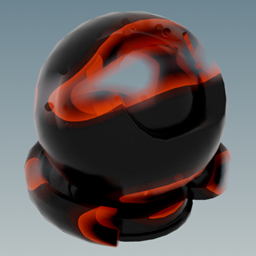
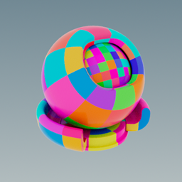

# WARNING
These examples were written while __ShadingLanguageX__ was being developed. It's possible that they will not compile as intended due to language features of __ShadingLanguageX__ being updated over time. I am keeping them here as a reference for developers as most of the code in them is still useful and valid, but they should not be copied verbatim.

Procedural Rain                    |  Interior Mapping | Shader Art (by Kishimisu)
:---------------------------:|:---------------------------:|:---------------------------:
   |   |  
__Displacement Mountain__   |  __Interior Mapping With Shadows (by VRBN)__ | __Toon__
  |   | 
__Disintegration__   |  __Colored Squares__ | __Gold__
  |   | 
